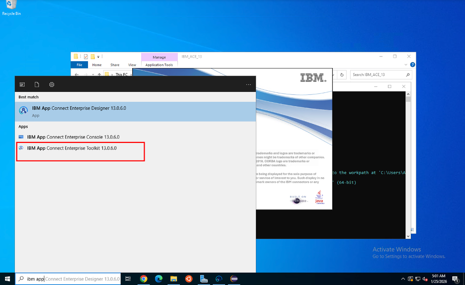
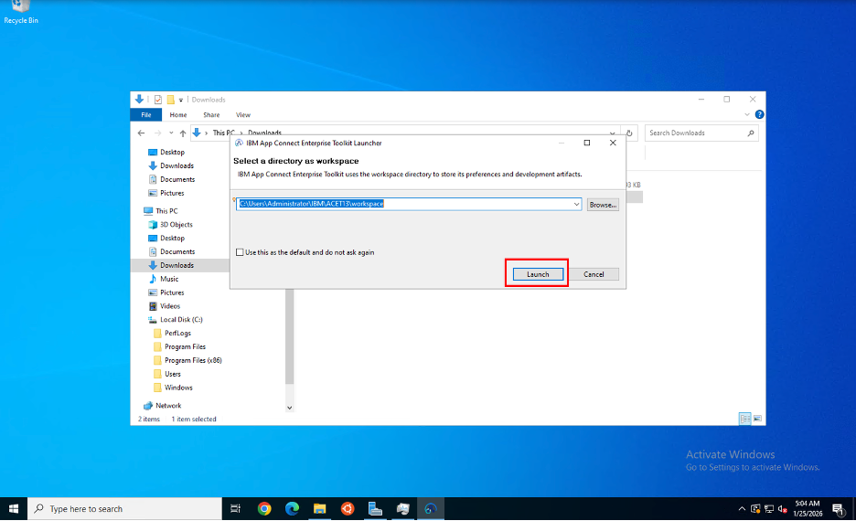
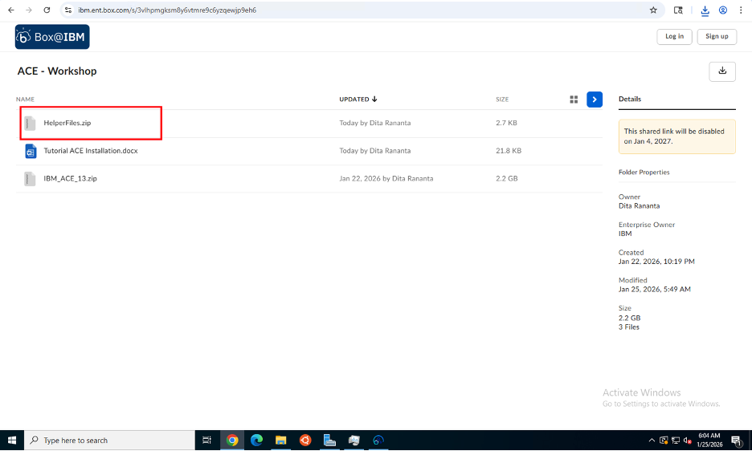
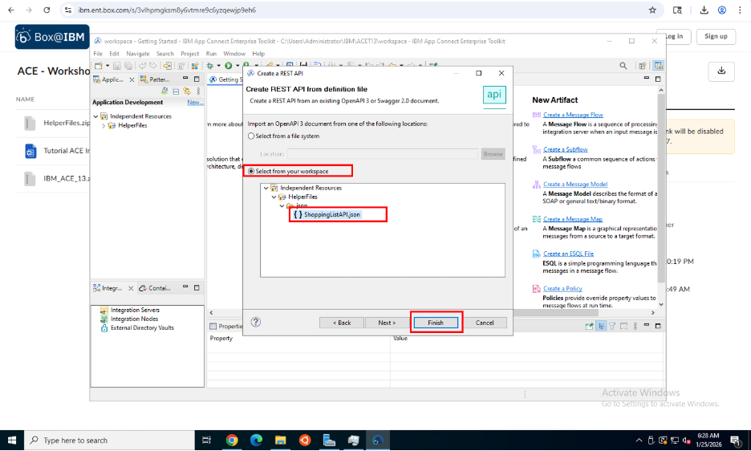
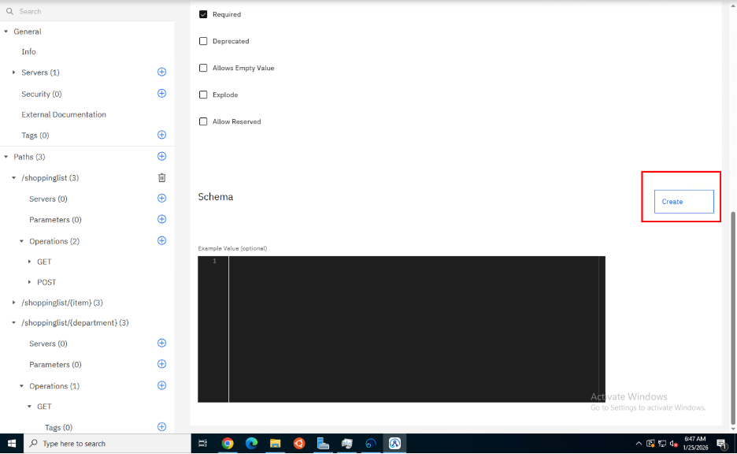
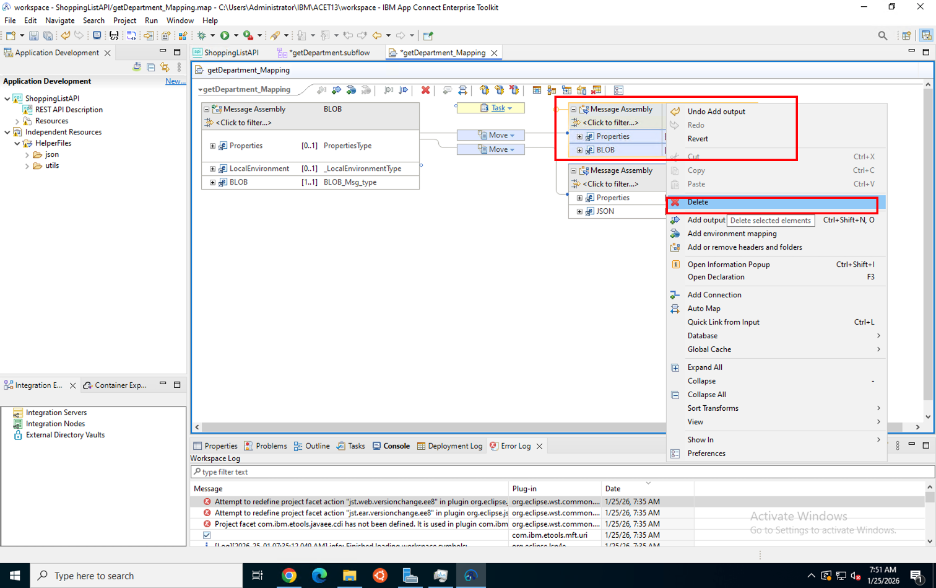
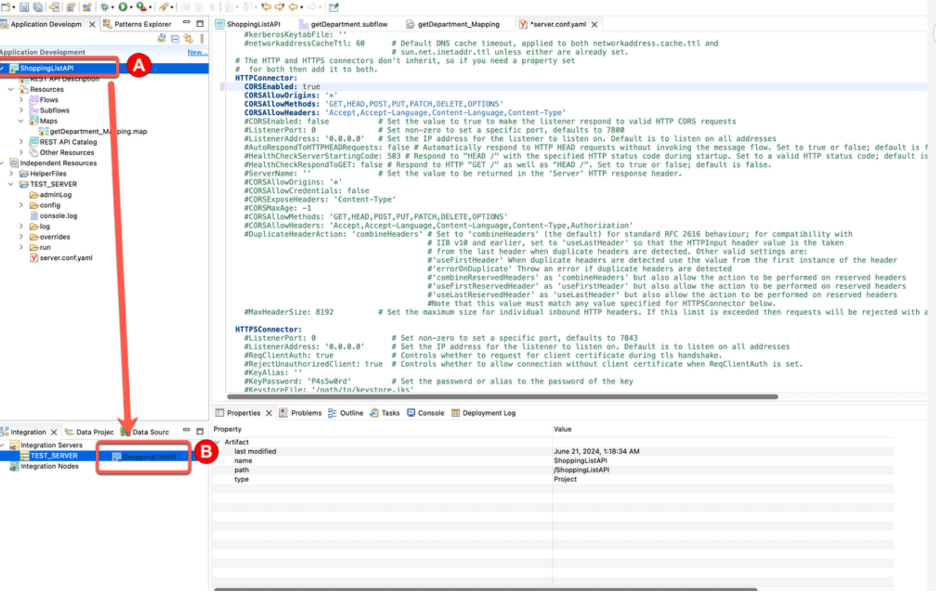
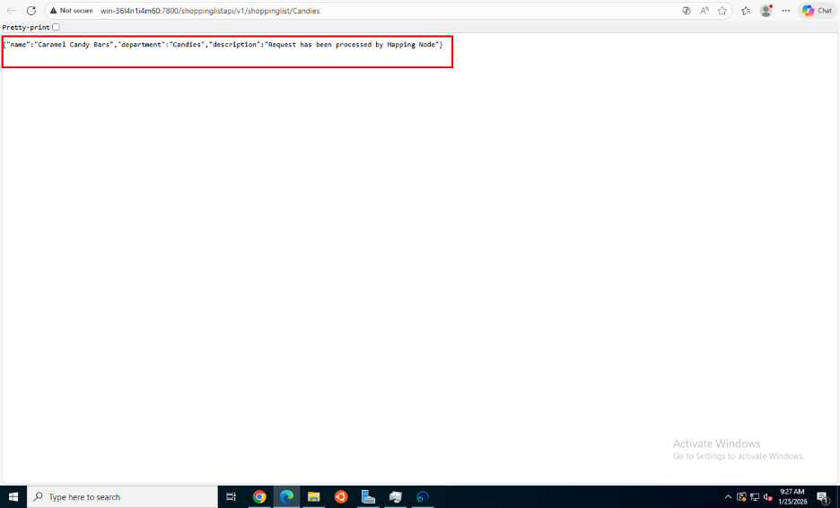

# Tutorial: Creating a REST API in IBM App Connect Enterprise (ACE)

## Overview
This tutorial guides you through creating a REST API in IBM App Connect Enterprise Toolkit version 13.0.6.0. You'll learn how to import an OpenAPI specification, implement message flows, and test your REST API endpoints.

## Learning Objectives
By the end of this tutorial, you will be able to:
- Launch IBM App Connect Enterprise Toolkit
- Create a REST API from an OpenAPI/Swagger specification
- Implement REST API operations (GET, POST)
- Configure HTTP nodes and message flows
- Deploy and test your REST API

## Prerequisites
Before starting this tutorial, ensure you have:
- IBM App Connect Enterprise Toolkit 13.0.6.0 installed
- Basic understanding of REST APIs and HTTP methods
- Access to the workshop materials (ShoppingListAPI.json)
- A workspace directory configured

## Tutorial Duration
Approximately 45-60 minutes

---

## Part 1: Setting Up the Environment

### Step 1: Launch IBM App Connect Enterprise Toolkit



1. Open the Windows Start menu
2. Search for "IBM App Connect Enterprise Toolkit 13.0.6.0"
3. Click on the application to launch it

**What's happening:** The ACE Toolkit is the integrated development environment (IDE) where you'll design, develop, and test your integration solutions.

---

### Step 2: Select Workspace Directory



1. When prompted, select or create a workspace directory
2. The default path shown is: `C:\Users\Administrator\IBM\ACE\13.0.6.0\workspace`
3. Optionally check "Use this as the default and do not ask again"
4. Click **Launch**

**What's happening:** The workspace is where ACE stores all your projects, configurations, and development artifacts. Each workspace can contain multiple applications and libraries.

---

## Part 2: Accessing Workshop Materials

### Step 3: Download Helper Files



1. Access the workshop materials from the provided Box folder
2. Download the **HelperFiles.zip** file
3. Extract the contents to a known location
4. Locate the **ShoppingListAPI.json** file - this is the OpenAPI specification we'll use

**What's happening:** The ShoppingListAPI.json file contains the REST API definition including endpoints, operations, request/response schemas, and documentation.

---

## Part 3: Creating the REST API

### Step 4: Create a New REST API



1. In the ACE Toolkit, go to **File** → **New** → **REST API**
2. In the "Create a REST API" dialog, select **Import an OpenAPI 2.0 document from one of the following locations**
3. Choose **Select from your workspace**
4. Navigate to and select **ShoppingListAPI.json** from the Independent Resources → HelperFiles folder
5. Click **Finish**

**What's happening:** ACE imports the OpenAPI specification and automatically generates the REST API structure, including all defined paths, operations, and schemas.

---

### Step 5: Review the REST API Structure



After import, you'll see the REST API editor with:
- **General** section: Basic API information
- **Servers**: API server configurations
- **Paths**: Available endpoints
  - `/shoppinglist` with GET and POST operations
  - `/shoppinglist/{item}` with GET operation
- **Operations**: HTTP methods for each path
- **Schema**: Data models and structures

**What's happening:** The REST API editor provides a visual interface to view and modify your API definition. Each path represents a different endpoint, and operations define what HTTP methods are supported.

---

## Part 4: Implementing the Message Flow

### Step 6: Create Subflow for GET Operation



1. In the Application Development view, expand your REST API project
2. Right-click on the **getDepartment_Mapping** subflow
3. Select **Open** to view the message flow canvas
4. You'll see the flow structure with:
   - **Input node**: Receives the HTTP request
   - **Message Assembly nodes**: Process and transform data
   - **Output node**: Sends the HTTP response

**What's happening:** Subflows are reusable message flow components. The mapping subflow handles the business logic for transforming requests into responses.

---

### Step 7: Add and Configure Nodes


To implement the REST API logic:

1. **Right-click** on the canvas to add nodes
2. Common nodes to use:
   - **Compute Node**: For data transformation and logic
   - **Database Node**: For database operations
   - **Mapping Node**: For graphical data mapping
   - **HTTP Request**: For calling external services

3. **Connect the nodes** by dragging from output terminals to input terminals
4. **Configure each node** by double-clicking and setting properties

**What's happening:** Each node performs a specific function in the message flow. The flow processes messages sequentially from input to output, transforming data at each step.

---

## Part 5: Configuring the REST API

### Step 8: Configure REST API Properties



1. Select the **REST API** in the Application Development view
2. In the Properties view, configure:
   - **Base Path**: `/shoppinglist/api/v1`
   - **HTTP Connector**: Settings for the HTTP listener
   - **CORS Settings**: Cross-Origin Resource Sharing configuration
   - **Security**: Authentication and authorization settings

**Key Properties:**
- **listenerAddress**: IP address to listen on (0.0.0.0 for all interfaces)
- **listenerPort**: Port number (default: 7800)
- **maxHeaderSize**: Maximum HTTP header size (8192 bytes)

**What's happening:** These properties control how your REST API behaves at runtime, including network settings, security, and HTTP protocol configurations.

---

## Part 6: Deploying the REST API

### Step 9: Create Integration Server


1. In the **Integration Nodes** view, right-click and select **Create Integration Server**
2. Name your integration server (e.g., "REST_SERVER")
3. The server will appear in the Integration Nodes view

**What's happening:** An Integration Server is a runtime environment that hosts and executes your integration applications. It processes incoming messages and routes them through your message flows.

---

### Step 10: Deploy the Application

1. Right-click on your REST API project
2. Select **Deploy** → **REST_SERVER**
3. Wait for deployment confirmation in the console

**What's happening:** Deployment packages your REST API and deploys it to the Integration Server, making it available to receive HTTP requests.

---

## Part 7: Testing the REST API

### Step 11: Test with Web Browser



1. Open a web browser
2. Navigate to: `http://localhost:7800/shoppinglist/api/v1/shoppinglist/Candies`
3. You should see a JSON response:

```json
{
  "name": "Caramel Candy Bars",
  "department": "Candies",
  "description": "Request has been processed by Mapping Node"
}
```

**What's happening:** The browser sends an HTTP GET request to your REST API. The Integration Server receives the request, processes it through your message flow, and returns the JSON response.

---

### Step 12: Test with REST Client (Optional)

You can also test using tools like:
- **Postman**: Full-featured REST client
- **cURL**: Command-line tool
- **ACE Test Client**: Built-in testing tool

Example cURL command:
```bash
curl -X GET http://localhost:7800/shoppinglist/api/v1/shoppinglist/Candies
```

---

## Understanding the Complete Flow

Here's what happens when a request is made:

1. **Client Request**: Browser/client sends HTTP GET request
2. **HTTP Listener**: Integration Server receives request on port 7800
3. **REST API**: Routes request to appropriate operation based on path
4. **Message Flow**: Processes request through configured nodes
5. **Response Generation**: Creates JSON response with requested data
6. **HTTP Response**: Returns response to client with status code 200

---

## Key Concepts Explained

### REST API Structure
- **Base Path**: The root URL path for all API endpoints
- **Paths**: Individual endpoints (e.g., `/shoppinglist`, `/shoppinglist/{item}`)
- **Operations**: HTTP methods (GET, POST, PUT, DELETE)
- **Parameters**: Path parameters, query parameters, headers
- **Schemas**: Data structure definitions for requests/responses

### Message Flow Components
- **Input Node**: Entry point for messages
- **Compute Node**: Executes ESQL code for transformations
- **Mapping Node**: Visual data transformation
- **Output Node**: Exit point sending responses

### HTTP Status Codes
- **200 OK**: Successful GET request
- **201 Created**: Successful POST request
- **400 Bad Request**: Invalid request data
- **404 Not Found**: Resource not found
- **500 Internal Server Error**: Server-side error

---

## Troubleshooting

### Common Issues and Solutions

**Issue: Port Already in Use**
- **Symptom**: Error message "Address already in use"
- **Solution**: Change the listenerPort in REST API properties or stop the conflicting service

**Issue: 404 Not Found**
- **Symptom**: Browser returns 404 error
- **Solution**: Verify the URL path matches the base path + endpoint path exactly

**Issue: Deployment Failed**
- **Symptom**: Error in console during deployment
- **Solution**: Check for syntax errors in message flows, ensure Integration Server is running

**Issue: Empty Response**
- **Symptom**: Request succeeds but returns empty body
- **Solution**: Verify message flow logic, check Compute node ESQL code

**Issue: Cannot Connect to Server**
- **Symptom**: Browser cannot reach the endpoint
- **Solution**: Verify Integration Server is running, check firewall settings, confirm port number

---

## Best Practices

1. **API Design**
   - Use meaningful endpoint names
   - Follow REST conventions (GET for retrieval, POST for creation)
   - Version your APIs (e.g., `/api/v1/`)
   - Document all endpoints and parameters

2. **Error Handling**
   - Implement proper error handling in message flows
   - Return appropriate HTTP status codes
   - Provide meaningful error messages

3. **Security**
   - Implement authentication (Basic Auth, OAuth, API Keys)
   - Use HTTPS in production
   - Validate all input data
   - Implement rate limiting

4. **Performance**
   - Keep message flows simple and efficient
   - Use connection pooling for databases
   - Implement caching where appropriate
   - Monitor server resources

5. **Testing**
   - Test all endpoints and operations
   - Test error scenarios
   - Validate response formats
   - Perform load testing

---

## Next Steps

After completing this tutorial, you can:

1. **Add More Operations**: Implement PUT and DELETE operations
2. **Connect to Database**: Integrate with DB2 or other databases (see Tutorial 3)
3. **Add Data Transformation**: Learn advanced mapping techniques (see Tutorial 2)
4. **Implement SOAP Integration**: Connect REST APIs to SOAP services (see Tutorial 4)
5. **Add Security**: Implement authentication and authorization
6. **Deploy to Production**: Learn deployment best practices

---

## Summary

In this tutorial, you learned how to:
- ✅ Launch and configure IBM App Connect Enterprise Toolkit
- ✅ Import an OpenAPI specification to create a REST API
- ✅ Understand REST API structure and components
- ✅ Implement message flows for API operations
- ✅ Configure REST API properties
- ✅ Deploy to an Integration Server
- ✅ Test REST API endpoints

You now have a working REST API that can receive HTTP requests and return JSON responses. This foundation can be extended with database connectivity, complex transformations, and integration with other systems.

---

## Additional Resources

- [IBM App Connect Enterprise Documentation](https://www.ibm.com/docs/en/app-connect/13.0)
- [REST API Development Guide](https://www.ibm.com/docs/en/app-connect/13.0?topic=apis-developing-rest)
- [OpenAPI Specification](https://swagger.io/specification/)
- [ACE Community Forums](https://community.ibm.com/community/user/integration/communities/community-home?CommunityKey=38bd2f7c-8e8e-4e1e-8e6e-0e8e8e8e8e8e)

---

## Glossary

- **ACE**: App Connect Enterprise - IBM's integration platform
- **REST**: Representational State Transfer - architectural style for APIs
- **OpenAPI**: Specification format for describing REST APIs
- **Integration Server**: Runtime environment for executing message flows
- **Message Flow**: Visual representation of integration logic
- **Subflow**: Reusable message flow component
- **ESQL**: Extended Structured Query Language - ACE's scripting language
- **HTTP Connector**: Component that handles HTTP protocol communication

---

**Workshop Version**: 1.0  
**Last Updated**: January 2026  
**ACE Version**: 13.0.6.0