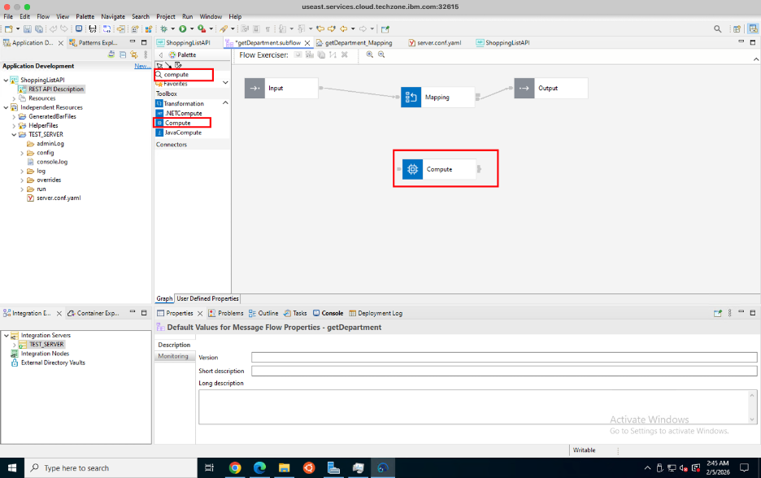
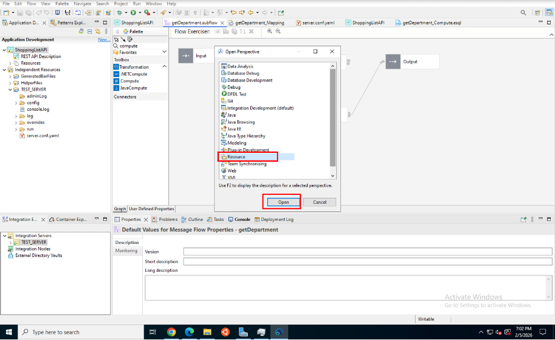
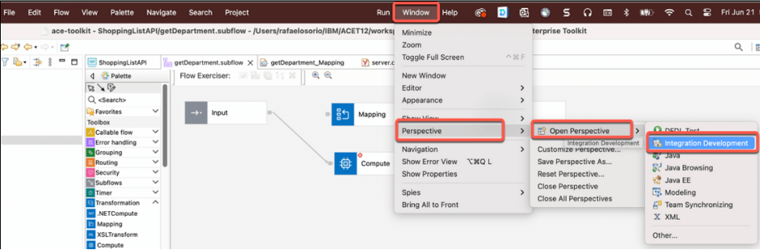
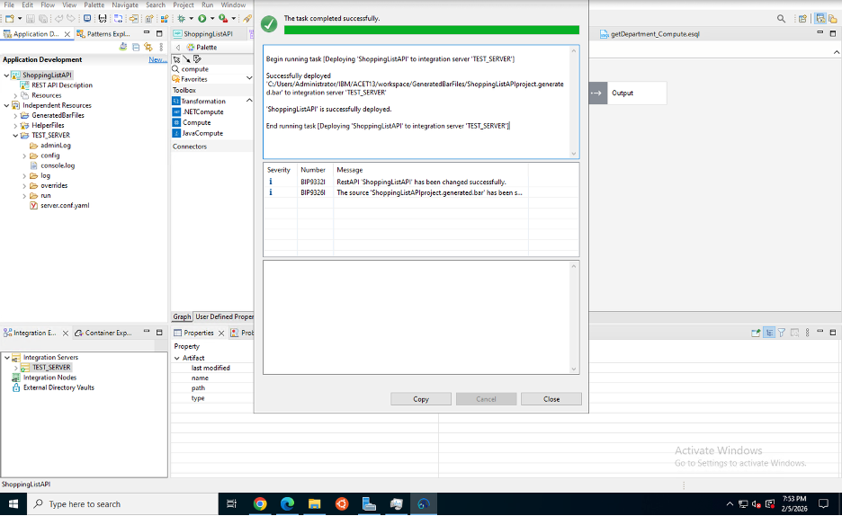
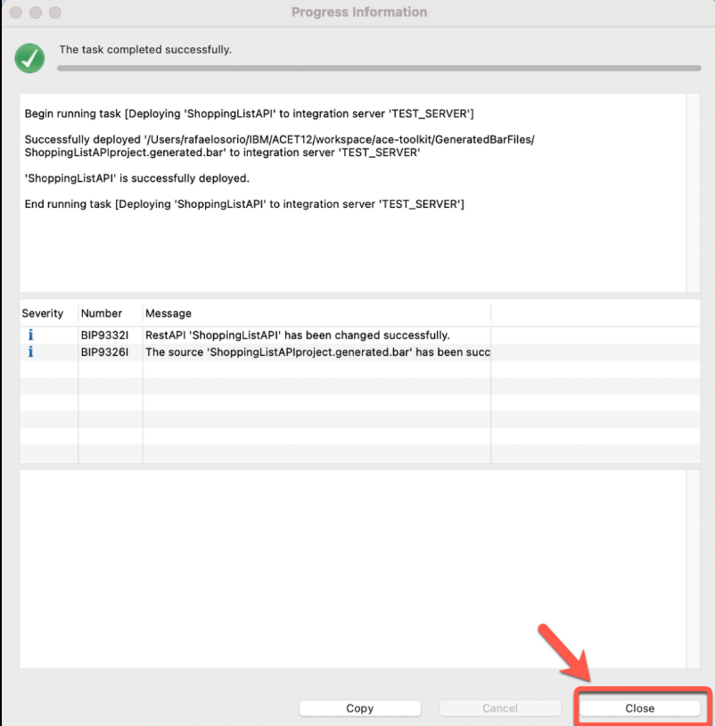
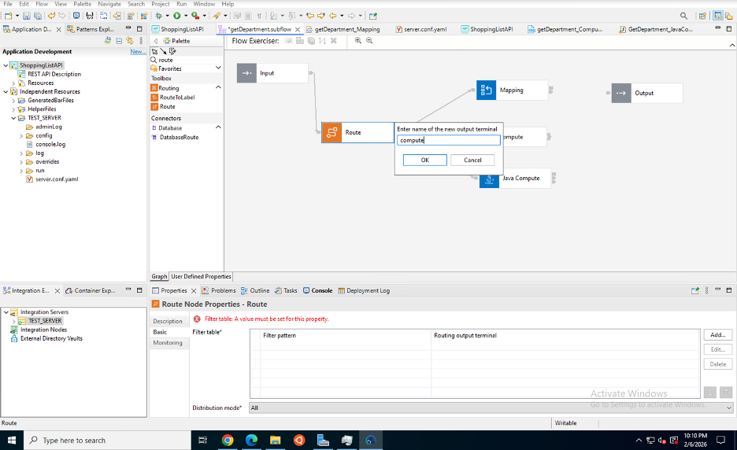
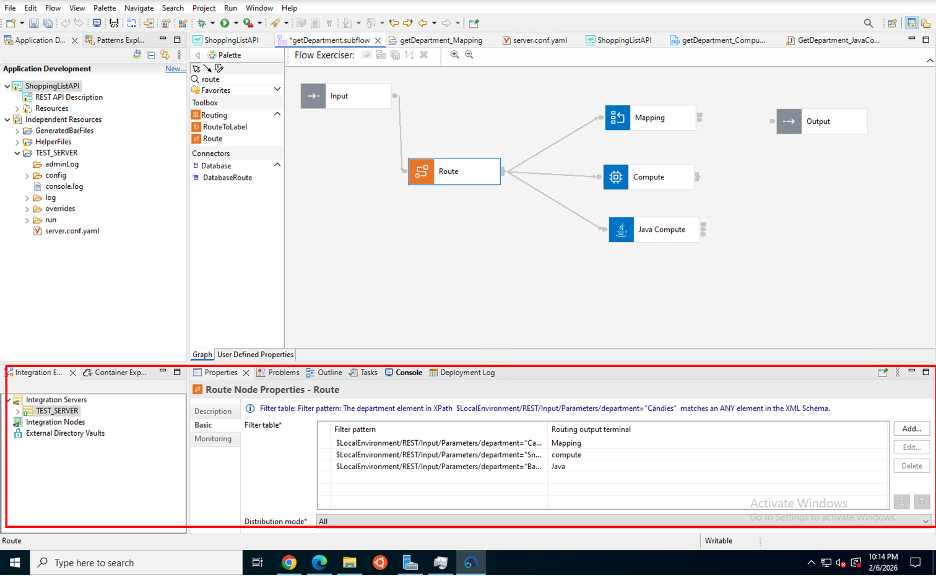
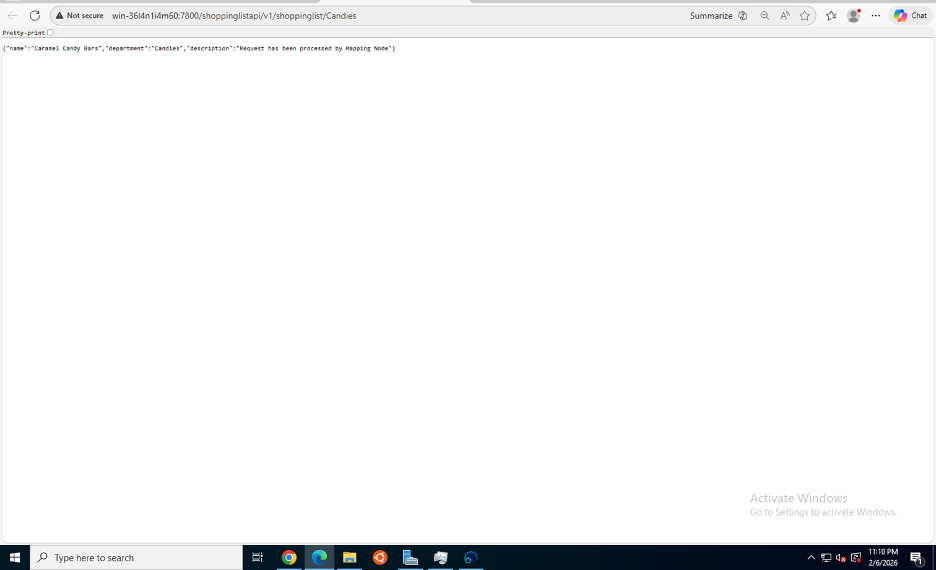

# Tutorial: Data Transformation in IBM App Connect Enterprise (ACE)

## Overview
This tutorial teaches you how to transform data in IBM App Connect Enterprise using various transformation techniques. You'll learn to use Compute nodes, Mapping nodes, and Route nodes to manipulate and route messages based on content.

## Learning Objectives
By the end of this tutorial, you will be able to:
- Add transformation nodes to message flows
- Use Compute nodes with ESQL for data transformation
- Implement graphical mapping for data transformation
- Configure Route nodes for content-based routing
- Switch between different ACE perspectives
- Test transformed data through REST API endpoints

## Prerequisites
Before starting this tutorial, ensure you have:
- Completed Tutorial 1: Create REST API
- IBM App Connect Enterprise Toolkit 13.0.6.0 installed and configured
- ShoppingListAPI project deployed and running
- Basic understanding of message flows and REST APIs
- Familiarity with JSON data structures

## Tutorial Duration
Approximately 45-60 minutes

---

## Part 1: Understanding Data Transformation

### What is Data Transformation?
Data transformation is the process of converting data from one format or structure to another. In ACE, you can transform data using:

- **Compute Nodes**: Write ESQL code for complex transformations
- **Mapping Nodes**: Use graphical interface to map fields
- **Route Nodes**: Direct messages based on content
- **Java Compute Nodes**: Use Java for transformations
- **XSLT Nodes**: Transform XML data

### When to Use Each Method

| Method | Best For | Complexity |
|--------|----------|------------|
| Compute Node | Complex logic, calculations, conditional transformations | High |
| Mapping Node | Simple field-to-field mapping, visual representation | Low-Medium |
| Route Node | Content-based routing, decision making | Medium |
| Java Compute | Java developers, complex business logic | High |

---

## Part 2: Adding Compute Node for Transformation

### Step 1: Open the Message Flow



1. In the Application Development view, expand your **ShoppingListAPI** project
2. Navigate to **getDepartment_subflow**
3. Double-click to open the message flow canvas
4. You'll see the existing flow with Input, Mapping, and Output nodes

**What's happening:** The message flow canvas is where you design the processing logic. Each node performs a specific transformation or routing function.

---

### Step 2: Add a Compute Node


1. From the **Palette** on the left, expand the **Transformation** section
2. Locate the **Compute** node
3. Drag and drop it onto the canvas between the Mapping and Output nodes
4. The Compute node will appear on the canvas

**What's happening:** The Compute node allows you to write ESQL (Extended Structured Query Language) code to transform message content, perform calculations, and manipulate data structures.

---

### Step 3: Configure Compute Node Properties


1. Double-click the Compute node to open its properties
2. In the **Properties** view at the bottom, you'll see:
   - **Description**: Add a meaningful description
   - **Monitoring**: Configure monitoring settings
   - **Short description**: Brief description of the node's purpose
   - **Long description**: Detailed explanation

3. Set the description to: "Transform department data"

**What's happening:** Proper documentation helps team members understand the purpose of each node in your message flow.

---

## Part 3: Switching to Integration Development Perspective

### Step 4: Open Perspective Dialog



1. Go to **Window** menu → **Perspective** → **Open Perspective**
2. A dialog will appear showing available perspectives
3. Select **Parse or Development** from the list

**What's happening:** Perspectives in ACE organize the workspace for specific tasks. The Integration Development perspective provides tools optimized for developing and debugging message flows.

---

### Step 5: Select Integration Development Perspective



1. In the perspective list, locate **Integration Development**
2. Click on it to select
3. Click **Open** to switch to this perspective

**What's happening:** The Integration Development perspective provides additional views and tools for working with ESQL code, debugging, and testing message flows.

---

## Part 4: Deploying the Updated Flow

### Step 6: Deploy to Integration Server



1. Right-click on your **ShoppingListAPI** project
2. Select **Deploy** → **TEST_SERVER** (or your integration server name)
3. A deployment progress dialog will appear
4. Wait for the message: "The task completed successfully"
5. You'll see confirmation messages:
   - "Successfully deployed 'ShoppingListAPI' to integration server 'TEST_SERVER'"
   - "ShoppingListAPI is successfully deployed"

**What's happening:** Deployment packages your updated message flow and deploys it to the Integration Server, making the changes active and ready to process requests.

---

### Step 7: Verify Deployment Success



1. Review the deployment log in the progress dialog
2. Check for any errors or warnings
3. Verify the severity column shows only informational messages (i)
4. Click **Close** to dismiss the dialog

**Key Messages to Look For:**
- **BIP3328I**: RestAPI 'ShoppingListAPI' has been changed successfully
- **BIP9326I**: The source 'ShoppingListAPI/project.generated.bar' has been successfully deployed

**What's happening:** These messages confirm that your REST API with the updated transformation logic has been successfully deployed and is ready to receive requests.

---

## Part 5: Adding Route Node for Content-Based Routing

### Step 8: Add Route Node to Flow



1. From the **Palette**, expand the **Routing** section
2. Drag a **Route** node onto the canvas
3. Position it between existing nodes where routing logic is needed
4. A dialog will appear: "Enter name of the new output terminal"
5. Enter a meaningful name like **"compute4"**
6. Click **OK**

**What's happening:** The Route node examines message content and directs messages to different output terminals based on filter patterns. This enables content-based routing where different data types or values follow different processing paths.

---

### Step 9: Connect Route Node



1. Connect the input terminal of the Route node to the previous node's output
2. Connect the Route node's output terminals to subsequent nodes:
   - **Mapping** terminal → connects to Mapping node
   - **compute4** terminal → connects to Compute node
3. Ensure all connections are properly established

**What's happening:** The connections define the message flow path. Based on the filter patterns you configure, messages will be routed to either the Mapping node or the Compute node.

---

### Step 10: Configure Route Filter Patterns


1. Select the Route node
2. In the **Properties** view, locate the **Filter table** section
3. You'll see the filter patterns configured:
   - **Filter pattern**: `$LocalEnvironment/REST/Input/Parameters/department = "Candies"`
   - **Routing output terminal**: Mapping
   - **Filter pattern**: `$LocalEnvironment/REST/Input/Parameters/department = "compute"`
   - **Routing output terminal**: compute4

4. These patterns check the department parameter from the REST request

**What's happening:** Filter patterns use XPath expressions to evaluate message content. When a pattern matches, the message is routed to the corresponding output terminal. This allows different departments to be processed differently.

---

### Step 11: Understanding Filter Pattern Syntax

**Filter Pattern Components:**

```
$LocalEnvironment/REST/Input/Parameters/department = "Candies"
```

- **$LocalEnvironment**: Message tree containing request metadata
- **REST/Input/Parameters**: Path to REST API parameters
- **department**: The specific parameter to check
- **= "Candies"**: The condition to match

**Common Filter Operators:**
- `=` : Equals
- `!=` : Not equals
- `>` : Greater than
- `<` : Less than
- `AND` : Logical AND
- `OR` : Logical OR

**Example Patterns:**
```
$LocalEnvironment/REST/Input/Parameters/department = "Electronics"
$Body/order/total > 1000
$Root/JSON/Data/status = "active" AND $Root/JSON/Data/priority = "high"
```

---

## Part 6: Testing the Transformation

### Step 12: Test with Browser - Mapping Path



1. Open a web browser
2. Navigate to: `http://localhost:7800/shoppinglist/api/v1/shoppinglist/Candies`
3. Observe the JSON response:

```json
{
  "name": "Caramel Candy Bars",
  "department": "Candies",
  "description": "Request has been processed by Mapping Node"
}
```

**What's happening:** When the department parameter is "Candies", the Route node directs the message to the Mapping node, which processes it and returns this response.

---

### Step 13: Test with Browser - Compute Path

1. Open a web browser
2. Navigate to: `http://localhost:7800/shoppinglist/api/v1/shoppinglist/compute`
3. Observe the different JSON response based on Compute node processing

**What's happening:** When the department parameter is "compute", the Route node directs the message to the Compute node, which applies different transformation logic.

---

## Part 7: Advanced Transformation Techniques

### Using ESQL in Compute Nodes

ESQL (Extended Structured Query Language) is ACE's scripting language for message transformation. Here are common operations:

#### Creating Output Message
```sql
CREATE FIELD OutputRoot.JSON.Data;
SET OutputRoot.JSON.Data.name = 'Product Name';
SET OutputRoot.JSON.Data.price = 99.99;
```

#### Copying Input to Output
```sql
SET OutputRoot = InputRoot;
```

#### Conditional Logic
```sql
IF InputRoot.JSON.Data.department = 'Electronics' THEN
    SET OutputRoot.JSON.Data.discount = 0.10;
ELSE
    SET OutputRoot.JSON.Data.discount = 0.05;
END IF;
```

#### Looping Through Arrays
```sql
DECLARE i INTEGER 1;
DECLARE itemCount INTEGER CARDINALITY(InputRoot.JSON.Data.items[]);

WHILE i <= itemCount DO
    SET OutputRoot.JSON.Data.items[i].processed = TRUE;
    SET i = i + 1;
END WHILE;
```

#### String Manipulation
```sql
SET OutputRoot.JSON.Data.upperName = UPPER(InputRoot.JSON.Data.name);
SET OutputRoot.JSON.Data.lowerName = LOWER(InputRoot.JSON.Data.name);
SET OutputRoot.JSON.Data.length = LENGTH(InputRoot.JSON.Data.name);
```

#### Date and Time Operations
```sql
SET OutputRoot.JSON.Data.currentDate = CURRENT_DATE;
SET OutputRoot.JSON.Data.currentTime = CURRENT_TIME;
SET OutputRoot.JSON.Data.timestamp = CURRENT_TIMESTAMP;
```

---

### Using Mapping Nodes

Mapping nodes provide a graphical interface for data transformation:

**Advantages:**
- Visual representation of field mappings
- No coding required for simple transformations
- Easy to understand and maintain
- Built-in functions for common operations

**When to Use Mapping Nodes:**
- Simple field-to-field mapping
- Format conversions (JSON to XML, etc.)
- Basic data type conversions
- Straightforward transformations

**When to Use Compute Nodes Instead:**
- Complex business logic
- Conditional transformations
- Loops and iterations
- Database lookups
- External service calls

---

## Part 8: Best Practices for Data Transformation

### 1. Choose the Right Transformation Method

**Use Compute Nodes for:**
- Complex calculations
- Conditional logic with multiple branches
- Database operations
- External service calls
- Custom error handling

**Use Mapping Nodes for:**
- Simple field mappings
- Format conversions
- Visual documentation
- Team members unfamiliar with ESQL

**Use Route Nodes for:**
- Content-based routing
- Decision points in flows
- Directing to different processing paths

---

### 2. Performance Optimization

**Minimize Data Copying:**
```sql
-- Inefficient: Creates full copy
SET OutputRoot = InputRoot;
SET OutputRoot.JSON.Data.newField = 'value';

-- Efficient: Reference existing data
CREATE LASTCHILD OF OutputRoot DOMAIN 'JSON';
CREATE LASTCHILD OF OutputRoot.JSON NAME 'Data';
SET OutputRoot.JSON.Data = InputRoot.JSON.Data;
SET OutputRoot.JSON.Data.newField = 'value';
```

**Use REFERENCE for Large Messages:**
```sql
DECLARE inputRef REFERENCE TO InputRoot.JSON.Data;
-- Work with inputRef instead of full path
```

**Avoid Unnecessary Parsing:**
- Only parse message domains you need
- Use BLOB for pass-through scenarios

---

### 3. Error Handling

**Always Include Error Handling:**
```sql
BEGIN
    -- Your transformation logic
    SET OutputRoot.JSON.Data.result = InputRoot.JSON.Data.value * 2;
EXCEPTION
    WHEN SQLSTATE LIKE '%' THEN
        -- Handle errors gracefully
        SET OutputRoot.JSON.Data.error = 'Transformation failed';
        SET OutputRoot.JSON.Data.details = SQLSTATE;
END;
```

---

### 4. Code Organization

**Use Comments:**
```sql
-- Calculate discount based on customer tier
IF InputRoot.JSON.Data.customerTier = 'Gold' THEN
    SET discount = 0.20; -- 20% discount for Gold customers
ELSEIF InputRoot.JSON.Data.customerTier = 'Silver' THEN
    SET discount = 0.10; -- 10% discount for Silver customers
ELSE
    SET discount = 0.05; -- 5% discount for regular customers
END IF;
```

**Use Meaningful Variable Names:**
```sql
-- Good
DECLARE customerName CHARACTER;
DECLARE orderTotal DECIMAL;
DECLARE discountPercentage DECIMAL;

-- Avoid
DECLARE x CHARACTER;
DECLARE y DECIMAL;
DECLARE z DECIMAL;
```

---

### 5. Testing Strategies

**Test Different Scenarios:**
- Valid data with expected values
- Edge cases (empty strings, null values, maximum values)
- Invalid data (wrong types, missing fields)
- Large datasets for performance testing

**Use Flow Debugger:**
1. Set breakpoints in your message flow
2. Step through node by node
3. Inspect message content at each stage
4. Verify transformations are correct

---

## Troubleshooting

### Common Issues and Solutions

**Issue: Route Node Not Routing Correctly**
- **Symptom**: Messages always go to default terminal
- **Solution**: 
  - Verify filter pattern syntax
  - Check XPath expressions are correct
  - Ensure parameter names match exactly (case-sensitive)
  - Test filter patterns in isolation

**Issue: Compute Node ESQL Errors**
- **Symptom**: Deployment fails or runtime errors
- **Solution**:
  - Check ESQL syntax carefully
  - Verify all variables are declared
  - Ensure proper BEGIN/END blocks
  - Review error messages in console

**Issue: Mapping Node Not Transforming Data**
- **Symptom**: Output doesn't match expected format
- **Solution**:
  - Verify input and output message models
  - Check all field mappings are connected
  - Ensure data types are compatible
  - Test with sample data

**Issue: Null Pointer Exceptions**
- **Symptom**: Runtime error when accessing fields
- **Solution**:
  - Check if fields exist before accessing
  - Use COALESCE for default values
  - Validate input data structure

```sql
-- Safe field access
IF EXISTS(InputRoot.JSON.Data.optionalField[]) THEN
    SET OutputRoot.JSON.Data.value = InputRoot.JSON.Data.optionalField;
ELSE
    SET OutputRoot.JSON.Data.value = 'default';
END IF;
```

**Issue: Performance Degradation**
- **Symptom**: Slow message processing
- **Solution**:
  - Minimize data copying
  - Use REFERENCE for large messages
  - Avoid unnecessary parsing
  - Optimize ESQL loops
  - Consider caching frequently used data

---

## Understanding Message Trees

### Message Tree Structure

ACE messages are organized in a tree structure with several domains:

```
Root
├── Properties
│   └── MessageSet, MessageType, etc.
├── LocalEnvironment
│   ├── REST
│   │   └── Input
│   │       └── Parameters
│   └── Destination
├── Environment
│   └── Variables (user-defined)
└── Body (Message Content)
    ├── JSON
    │   └── Data
    ├── XML
    │   └── Elements
    └── BLOB
        └── Binary data
```

### Accessing Message Trees in ESQL

**Input Message:**
```sql
-- Access REST parameters
SET dept = InputLocalEnvironment.REST.Input.Parameters.department;

-- Access JSON body
SET productName = InputRoot.JSON.Data.product.name;

-- Access HTTP headers
SET contentType = InputRoot.HTTPInputHeader."Content-Type";
```

**Output Message:**
```sql
-- Create JSON output
CREATE FIELD OutputRoot.JSON.Data;
SET OutputRoot.JSON.Data.status = 'success';
SET OutputRoot.JSON.Data.message = 'Processed successfully';

-- Set HTTP response headers
SET OutputRoot.HTTPReplyHeader."Content-Type" = 'application/json';
```

**Environment Variables:**
```sql
-- Set environment variable
SET Environment.Variables.customerId = InputRoot.JSON.Data.id;

-- Access in subsequent nodes
SET OutputRoot.JSON.Data.customer = Environment.Variables.customerId;
```

---

## Advanced Routing Patterns

### Multiple Output Terminals

Configure Route node with multiple conditions:

```
Filter Pattern 1: $Body/order/priority = "high"
Output Terminal: highPriority

Filter Pattern 2: $Body/order/priority = "medium"
Output Terminal: mediumPriority

Filter Pattern 3: $Body/order/priority = "low"
Output Terminal: lowPriority

Default Terminal: defaultPath
```

### Complex Filter Expressions

```sql
-- Multiple conditions with AND
$Body/order/total > 1000 AND $Body/order/customer/tier = "Gold"

-- Multiple conditions with OR
$Body/order/status = "urgent" OR $Body/order/priority = "high"

-- Nested conditions
($Body/order/total > 1000 AND $Body/order/customer/tier = "Gold") OR 
($Body/order/priority = "urgent")

-- Pattern matching
$Body/order/productCode LIKE "ELEC%"

-- Null checks
$Body/order/discount IS NULL
```

---

## Integration with Other Tutorials

### Connecting to Tutorial 1 (REST API)
This tutorial builds on the REST API created in Tutorial 1. The transformation logic processes requests received through the REST endpoints.

### Preparing for Tutorial 3 (Database)
The transformation techniques learned here will be used to:
- Format data before database insertion
- Transform database query results for API responses
- Map between JSON and database record structures

### Preparing for Tutorial 4 (SOAP Mapping)
Transformation skills are essential for:
- Converting REST JSON to SOAP XML
- Mapping between different data formats
- Handling complex nested structures

---

## Summary

In this tutorial, you learned how to:
- ✅ Add Compute nodes for ESQL-based transformations
- ✅ Configure and use Route nodes for content-based routing
- ✅ Switch between ACE perspectives for different tasks
- ✅ Deploy updated message flows to Integration Server
- ✅ Configure filter patterns for routing logic
- ✅ Test transformations through REST API endpoints
- ✅ Understand message tree structures
- ✅ Apply best practices for data transformation
- ✅ Troubleshoot common transformation issues

You now have the skills to transform data in various ways, route messages based on content, and build more sophisticated integration flows.

---

## Next Steps

After completing this tutorial, you can:

1. **Experiment with Complex Transformations**: Try more advanced ESQL operations
2. **Create Custom Mapping Functions**: Build reusable transformation logic
3. **Proceed to Tutorial 3**: Learn database connectivity and data persistence
4. **Explore Java Compute Nodes**: Use Java for transformations
5. **Implement Error Handling**: Add comprehensive error handling to flows

---

## Additional Resources

- [ESQL Reference Guide](https://www.ibm.com/docs/en/app-connect/13.0?topic=reference-esql)
- [Message Flow Nodes](https://www.ibm.com/docs/en/app-connect/13.0?topic=nodes-message-flow)
- [Transformation Patterns](https://www.ibm.com/docs/en/app-connect/13.0?topic=patterns-transformation)
- [Route Node Documentation](https://www.ibm.com/docs/en/app-connect/13.0?topic=nodes-route-node)
- [Mapping Node Guide](https://www.ibm.com/docs/en/app-connect/13.0?topic=nodes-mapping-node)

---

## Quick Reference: ESQL Functions

### String Functions
- `UPPER(string)` - Convert to uppercase
- `LOWER(string)` - Convert to lowercase
- `SUBSTRING(string, start, length)` - Extract substring
- `LENGTH(string)` - Get string length
- `TRIM(string)` - Remove leading/trailing spaces
- `REPLACE(string, search, replace)` - Replace text

### Numeric Functions
- `ROUND(number, decimals)` - Round number
- `CEILING(number)` - Round up
- `FLOOR(number)` - Round down
- `ABS(number)` - Absolute value
- `POWER(base, exponent)` - Raise to power
- `SQRT(number)` - Square root

### Date/Time Functions
- `CURRENT_DATE` - Current date
- `CURRENT_TIME` - Current time
- `CURRENT_TIMESTAMP` - Current date and time
- `EXTRACT(part FROM datetime)` - Extract date part
- `CAST(value AS DATE)` - Convert to date

### Aggregate Functions
- `CARDINALITY(array)` - Count array elements
- `SUM(array)` - Sum array values
- `AVG(array)` - Average of array values
- `MAX(array)` - Maximum value
- `MIN(array)` - Minimum value

---

## Glossary

- **ESQL**: Extended Structured Query Language - ACE's scripting language
- **Compute Node**: Node that executes ESQL code for transformations
- **Route Node**: Node that directs messages based on filter patterns
- **Mapping Node**: Visual tool for field-to-field data mapping
- **Filter Pattern**: XPath expression used to evaluate message content
- **Message Tree**: Hierarchical structure containing message data
- **LocalEnvironment**: Message tree containing request metadata
- **Perspective**: Workspace layout optimized for specific tasks
- **Output Terminal**: Connection point where messages exit a node
- **XPath**: Query language for selecting nodes in XML/JSON structures

---

**Workshop Version**: 1.0  
**Last Updated**: January 2026  
**ACE Version**: 13.0.6.0