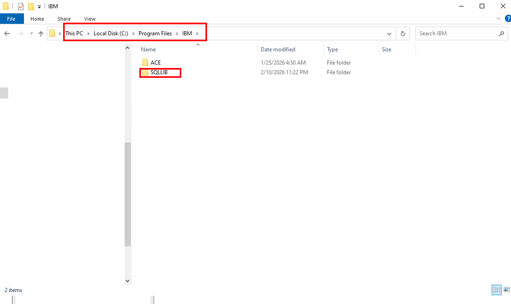
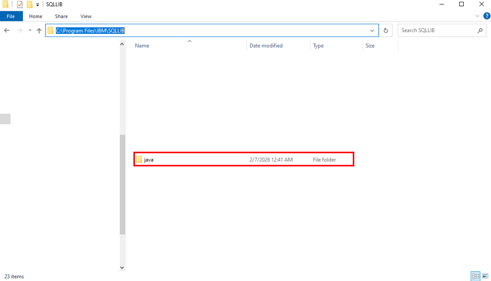

# Tutorial: Connecting to IBM DB2 Database in App Connect Enterprise

## Overview
This tutorial teaches you how to connect IBM App Connect Enterprise to an IBM DB2 database. You'll learn to configure database policies, import database-enabled projects, execute SQL queries, and retrieve data from DB2 through REST API endpoints.

## Learning Objectives
By the end of this tutorial, you will be able to:
- Import pre-configured database projects
- Configure DB2 database policies
- Set up JDBC connections to DB2
- Deploy database-enabled applications
- Execute SQL queries from message flows
- Test database operations through REST APIs
- Handle database responses in JSON format

## Prerequisites
Before starting this tutorial, ensure you have:
- Completed Tutorial 1: Create REST API
- Completed Tutorial 2: Data Transformation
- IBM App Connect Enterprise Toolkit 13.0.6.0 installed
- Access to an IBM DB2 database instance
- DB2 JDBC driver (db2jcc4.jar)
- Database credentials (username, password, server, port)
- Basic understanding of SQL queries
- Postman or similar REST client for testing

## Tutorial Duration
Approximately 15-20 minutes

---

## Part 1: Understanding Database Integration

### Why Connect to Databases?
Integrating ACE with databases enables:
- **Data Persistence**: Store and retrieve business data
- **Real-time Queries**: Access current data for processing
- **CRUD Operations**: Create, Read, Update, Delete records
- **Data Validation**: Verify information against stored data
- **Reporting**: Generate reports from database queries
- **Transaction Management**: Ensure data consistency

### Database Integration Architecture

```
REST API Request
      ↓
ACE Integration Server
      ↓
Database Policy (Connection Config)
      ↓
JDBC Driver
      ↓
DB2 Database
      ↓
Query Results
      ↓
JSON Response
```

---

## Part 2: Importing the Database Project

### Step 1: Access Import Function


1. In ACE Toolkit, go to **File** menu
2. Select **Import...**
3. The Import wizard will open

**What's happening:** The Import function allows you to bring existing projects, libraries, and resources into your workspace. This is useful for sharing projects between team members or using pre-configured templates.

---

### Step 2: Select Project Interchange


1. In the Import wizard, expand **IBM Integration**
2. Select **Project Interchange**
3. Click **Next**

**What's happening:** Project Interchange is ACE's format for exporting and importing complete projects with all their resources, configurations, and dependencies. It packages everything needed to run the integration.

---

### Step 3: Browse for Project File


1. Click **Browse** to locate the project file
2. Navigate to the workshop materials folder
3. Select the database project ZIP file (e.g., `ExampleDatabaseRefine.zip`)
4. Click **Next** to proceed

**What's happening:** The project file contains pre-configured message flows, database queries, and policy configurations that demonstrate database connectivity patterns.

---

### Step 4: Complete Import

1. Review the projects to be imported
2. Ensure all required projects are selected
3. Click **Finish**
4. Wait for the import to complete
5. The project will appear in your Application Development view

**What's happening:** ACE extracts the project contents and adds them to your workspace, making all resources available for editing and deployment.

---

## Part 3: Configuring Database Policy

### Step 5: Open Database Policy




1. Download the Java file from the box 
2. Navigate to ``C:\Program Files\IBM\SQLLIB``
3. Put the downloaded Java in there, Unzip it

**What's happening:** A database policy defines connection parameters for accessing databases. It centralizes configuration, making it easy to change database settings without modifying message flows.

---

### Step 6: Configure Policy Properties


Configure the following properties in the policy editor:

**Basic Information:**
- **Name**: MyJDBCPolicy
- **Type**: JDBC Providers
- **Template**: DB2_91_Windows

**Database Configuration:**
- **Name of the database**: USERS
- **Type of the database**: DB2 Universal Database
- **Version of the database**: 11.1
- **JDBC driver class name**: com.ibm.db2.jcc.DB2Driver

**Connection Details:**
- **Connection URL format attribute 1**: jdbc:db2://[serverName]:[portNumber]/[databaseName]/currentSchema=MYSCHEMA;user=[user];password=[password]
- **Connection URL format attribute 2**: (Additional connection parameters)
- **Connection URL format attribute 3**: (Additional connection parameters)
- **Connection URL format attribute 4**: (Additional connection parameters)
- **Connection URL format attribute 5**: (Additional connection parameters)

**Server Configuration:**
- **Database server name**: 52.118.195.00
- **Database server port number**: 8080
- **Type 4 driver class JAR URL**: C:\Program Files\IBM\SQLLIB\java\db2jcc4.jar

**Additional Settings:**
- **Name of the database schema**: MYSCHEMA
- **Data source description**: (Optional description)
- **Maximum size of connection pool**: 0 (unlimited)
- **Security identity (DSN)**: mydbidentity
- **Environment parameters**: (Optional)
- **Supports XA coordinated transactions**: false
- **Use JAR files that have been deployed in a BAR file**: false

**What's happening:** These settings tell ACE how to connect to your DB2 database, including the server location, authentication method, and JDBC driver location.

---

### Step 7: Understanding Connection URL Format

The connection URL follows this pattern:
```
jdbc:db2://[serverName]:[portNumber]/[databaseName]/currentSchema=[schema];user=[user];password=[password]
```

**Components:**
- **jdbc:db2://**: Protocol for DB2 JDBC connection
- **serverName**: Database server hostname or IP (e.g., 52.118.195.00)
- **portNumber**: Database port (e.g., 8080)
- **databaseName**: Name of the database (e.g., USERS)
- **currentSchema**: Default schema to use (e.g., MYSCHEMA)
- **user**: Database username
- **password**: Database password

**Example:**
```
jdbc:db2://52.118.195.00:8080/USERS/currentSchema=MYSCHEMA;user=admin;password=secret123
```

---

### Step 8: Configure JDBC Driver Path

**Important:** Ensure the JDBC driver JAR file exists at the specified path:
```
C:\Program Files\IBM\SQLLIB\java\db2jcc4.jar
```

**If the driver is in a different location:**
1. Update the **Type 4 driver class JAR URL** field
2. Use the full path to your db2jcc4.jar file
3. Ensure the Integration Server has read access to this file

**Where to get the DB2 JDBC driver:**
- Included with DB2 client installation
- Download from IBM website
- Available in DB2 installation directory: `<DB2_HOME>/java/db2jcc4.jar`

---

### Step 9: Save Policy Configuration

1. After configuring all properties, click **File** → **Save** (or Ctrl+S)
2. Verify no validation errors appear
3. The policy is now ready to use

**What's happening:** Saving the policy makes it available for message flows to reference. Multiple flows can use the same policy, promoting reusability and consistency.

---

## Part 4: Deploying the Database Application

### Step 10: Deploy to Integration Server


1. Right-click on your database project (e.g., **ExampleDatabaseRefine**)
2. Select **Deploy** → **[Your Integration Server]**
3. A deployment progress dialog will appear
4. Monitor the deployment messages

**Deployment Messages:**
```
Begin running task [Deploying 'ExampleDatabaseRefine' to integration server 'server']

Successfully deployed '/Users/rafaelsoriano/IBM/ACE/12/workspace/GeneratedBarFiles/
ExampleDatabaseRefine/project.generated.bar' to integration server 'TEST_SER'

'ExampleDatabaseRefine' is successfully deployed.

End running task [Deploying 'ExampleDatabaseRefine' to integration server 'TEST_SER']
```

**What's happening:** Deployment packages your application with the database policy and deploys it to the Integration Server, making it ready to process requests and execute database queries.

---

### Step 11: Verify Deployment Success


1. Check the deployment log for success messages
2. Look for:
   - **BIP9332I**: Application 'ExampleDatabaseRefine' has been changed successfully
   - **BIP9326I**: The source has been successfully deployed
3. Verify no error messages appear
4. Click **Close** to dismiss the dialog

**What's happening:** These messages confirm that your database-enabled application is deployed and the Integration Server can now accept requests that will query the database.

---

## Part 5: Understanding the Message Flow

### Database Query Flow Architecture

A typical database query flow includes:

```
HTTP Input
    ↓
Compute Node (Build SQL Query)
    ↓
Database Node (Execute Query)
    ↓
Compute Node (Format Response)
    ↓
HTTP Reply
```

### Common Database Nodes

**1. Database Node**
- Executes SQL statements
- Supports SELECT, INSERT, UPDATE, DELETE
- Returns result sets
- Handles transactions

**2. Compute Node (Pre-Query)**
- Builds dynamic SQL queries
- Sets query parameters
- Validates input data
- Prepares database connection

**3. Compute Node (Post-Query)**
- Formats query results
- Transforms data to JSON/XML
- Handles errors
- Logs results

---

## Part 6: Testing Database Connectivity

### Step 12: Prepare Test Message


1. In ACE Toolkit, locate the **Flow Exerciser** or test client
2. Click **Send Message**
3. In the Send Message dialog:
   - **Name**: InputMessageUS
   - **Input Location**: HTTP Input
   - **Message Details**: Select or create test message
   - **Country**: Select **"US"** from dropdown

**What's happening:** The test message simulates an HTTP request to your REST API endpoint. The "Country" parameter will be used in the SQL query to filter database results.

---

### Step 13: Send Test Request

1. Verify the message configuration
2. Click **Send** to execute the request
3. Wait for the response
4. The Integration Server will:
   - Receive the HTTP request
   - Execute the SQL query with Country='US'
   - Retrieve matching records from DB2
   - Format results as JSON
   - Return the response

**What's happening:** ACE processes your request through the message flow, connects to DB2 using the configured policy, executes the query, and returns the results.

---

### Step 14: Test with Postman


**Alternative Testing Method:**

1. Open Postman
2. Create a new request:
   - **Method**: POST
   - **URL**: `http://localhost:7800/DatabaseRetrieveFlow`
   - **Headers**: 
     - Content-Type: application/json
   - **Body** (JSON):
     ```json
     {
       "Country": "US"
     }
     ```

3. Click **Send**

**Expected Response:**
```json
{
  "Country": "US",
  "Employee": [
    {
      "FIRSTNAME": "John",
      "LASTNAME": "Pho",
      "COUNTRY": "US"
    }
  ]
}
```

**What's happening:** Postman sends an HTTP POST request to your ACE endpoint. The message flow queries the database for employees in the US and returns the results in JSON format.

---

### Step 15: Test Different Countries

Try testing with different country codes:

**Test Case 1: United Kingdom**
```json
{
  "Country": "UK"
}
```

**Test Case 2: Canada**
```json
{
  "Country": "CA"
}
```

**Test Case 3: Multiple Results**
```json
{
  "Country": "US"
}
```

**What's happening:** Each request executes a different SQL query based on the country parameter, demonstrating dynamic query execution.

---

## Summary

In this tutorial, you learned how to:
- ✅ Import database-enabled projects into ACE
- ✅ Configure DB2 database policies with connection details
- ✅ Set up JDBC drivers for DB2 connectivity
- ✅ Deploy applications with database dependencies
- ✅ Execute SQL queries from message flows
- ✅ Process database result sets
- ✅ Test database operations via REST APIs
- ✅ Handle database errors gracefully
- ✅ Apply best practices for security and performance
- ✅ Troubleshoot common database connectivity issues

You now have the skills to integrate ACE with DB2 databases, enabling your integration flows to persist and retrieve data from enterprise databases.

---

## Additional Resources

- [IBM DB2 Documentation](https://www.ibm.com/docs/en/db2)
- [ACE Database Connectivity](https://www.ibm.com/docs/en/app-connect/13.0?topic=nodes-database-node)
- [JDBC Configuration Guide](https://www.ibm.com/docs/en/app-connect/13.0?topic=policies-jdbc-providers-policy)
- [SQL Reference for DB2](https://www.ibm.com/docs/en/db2/11.5?topic=reference-sql)
- [mqsisetdbparms Command](https://www.ibm.com/docs/en/app-connect/13.0?topic=commands-mqsisetdbparms)

---

## Quick Reference: Database Commands

### mqsisetdbparms Commands

```bash
# Set database credentials
mqsisetdbparms <server> -n jdbc::mydbidentity -u username -p password

# List configured credentials
mqsilist <server> -o SecurityIdentity

# Remove credentials
mqsideletecredentials <server> -n jdbc::mydbidentity
```

### Testing Database Connection

```bash
# Test JDBC connection
mqsitestjdbc <server> -n jdbc::mydbidentity -d USERS

# View server properties
mqsireportproperties <server> -o AllReportableEntityNames -r
```

---

## Glossary

- **JDBC**: Java Database Connectivity - API for connecting to databases
- **DB2**: IBM's relational database management system
- **Policy**: Configuration file defining connection parameters
- **Data Source**: Named database connection configuration
- **Connection Pool**: Reusable database connections for performance
- **SQLCODE**: Numeric code indicating SQL operation result
- **SQLSTATE**: Standard SQL error state code
- **Schema**: Logical grouping of database objects
- **Prepared Statement**: Pre-compiled SQL statement for efficiency
- **Result Set**: Data returned from a database query
- **Transaction**: Unit of work that must complete entirely or not at all

---

**Workshop Version**: 1.0  
**Last Updated**: January 2026  
**ACE Version**: 13.0.6.0  
**DB2 Version**: 11.1+