# Tutorial: Clone IBM App Connect Enterprise Project from GitLab

## Overview
This tutorial teaches you how to clone (download) an existing IBM App Connect Enterprise project from a GitLab repository into your local ACE Toolkit. You will learn how to access the GitLab repository, clone the project, and import it into your ACE Toolkit workspace.

## Learning Objectives
By the end of this tutorial, you will be able to:
- Access GitLab repository with provided credentials
- Clone an ACE project from GitLab
- Import the cloned project into ACE Toolkit
- Verify the project was successfully cloned and is ready to use
- Understand the structure of an ACE project cloned from GitLab

## Prerequisites
Before starting this tutorial, ensure you have:
- IBM App Connect Enterprise Toolkit 13.0.6.0 installed
- Git installed on your system
- Internet connection to access GitLab repository
- GitLab access credentials (username and password)

## Tutorial Duration
Approximately 10-15 minutes

---

## Part 1: Accessing GitLab Repository

### Step 1: Open GitLab in Browser

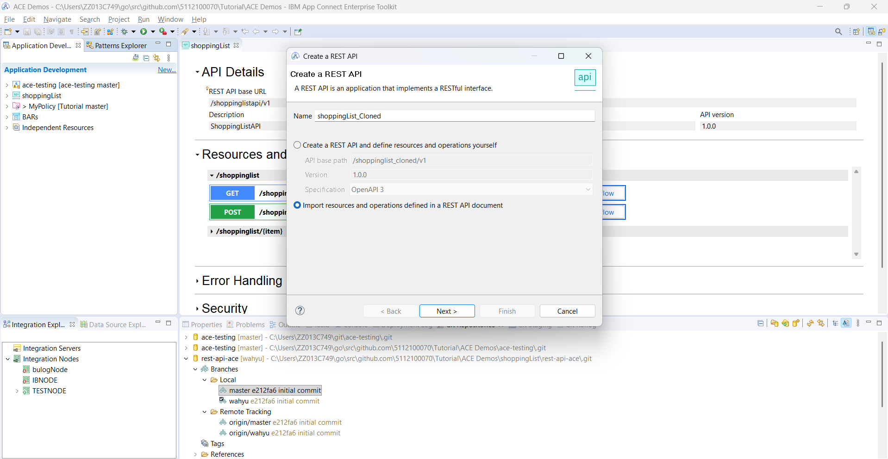

1. Open your web browser
2. Access the GitLab URL: **http://162.133.131.244**
3. You will see the GitLab login page

**What's happening:** You are accessing the GitLab server that hosts the IBM App Connect Enterprise project to be cloned.

---

### Step 2: Login to GitLab

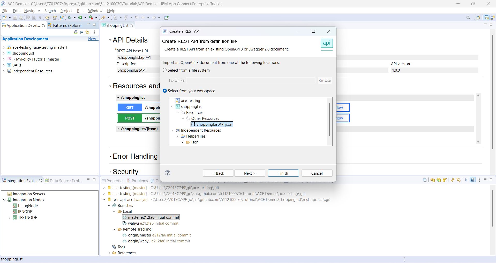

Enter the provided credentials:

1. **Username or email**: `public_access`
2. **Password**: `2026workshop`
3. Click the **Sign in** button

**What's happening:** You are logging in using the public access account that has permission to read and clone the repository.

---

### Step 3: Navigate to Repository

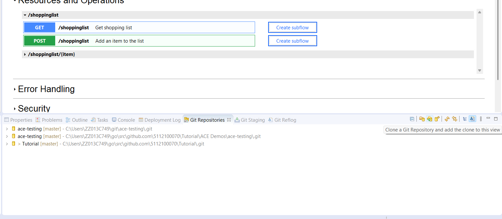

After successful login:

1. You will see the GitLab dashboard
2. Look for the project named **rest-api-ace**
3. Click on the project to open it

**What's happening:** You are opening the repository that contains the IBM App Connect Enterprise project to be cloned.

---

### Step 4: View Repository Details

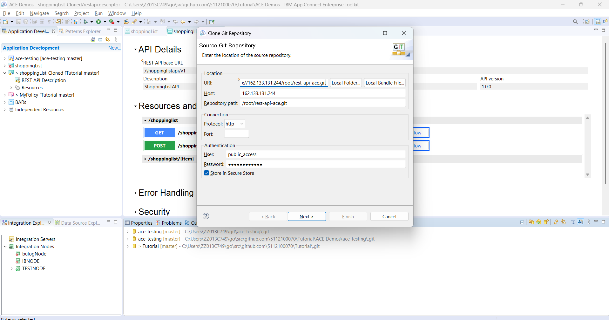

On the repository page, you can see:

1. **Project name**: rest-api-ace
2. **Files**: List of files and folders in the project
3. **Commits**: Project change history
4. **Branches**: Available branches (usually master or main)
5. **Clone button**: Button to get the clone URL

**What's happening:** You are viewing an overview of the ACE project to be cloned, including file structure and repository information.

---

## Part 2: Clone Repository to Local

### Step 5: Copy Repository URL

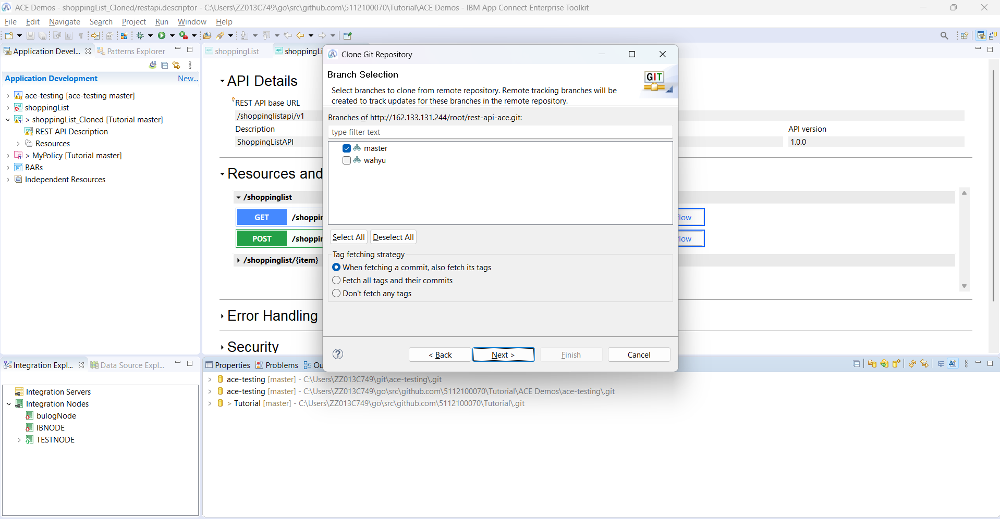

1. Click the **Clone** button on the repository page
2. Select **Clone with HTTPS**
3. Copy the repository URL: `http://162.133.131.244/root/rest-api-ace.git`
4. Click the copy icon or select and copy manually

**What's happening:** You are obtaining the URL that will be used to clone the repository to your local computer.

---

### Step 6: Open ACE Toolkit

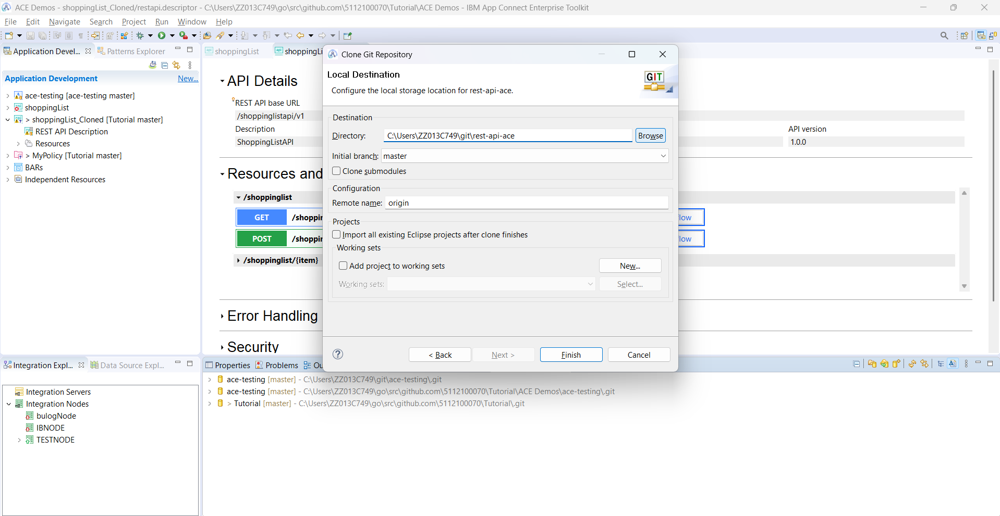

1. Open **IBM App Connect Enterprise Toolkit**
2. Ensure you are in the **Application Development** perspective
3. Your workspace is ready to receive the new project

**What's happening:** You are preparing the ACE Toolkit environment to receive the project to be cloned from GitLab.

---

### Step 7: Start Import from Git

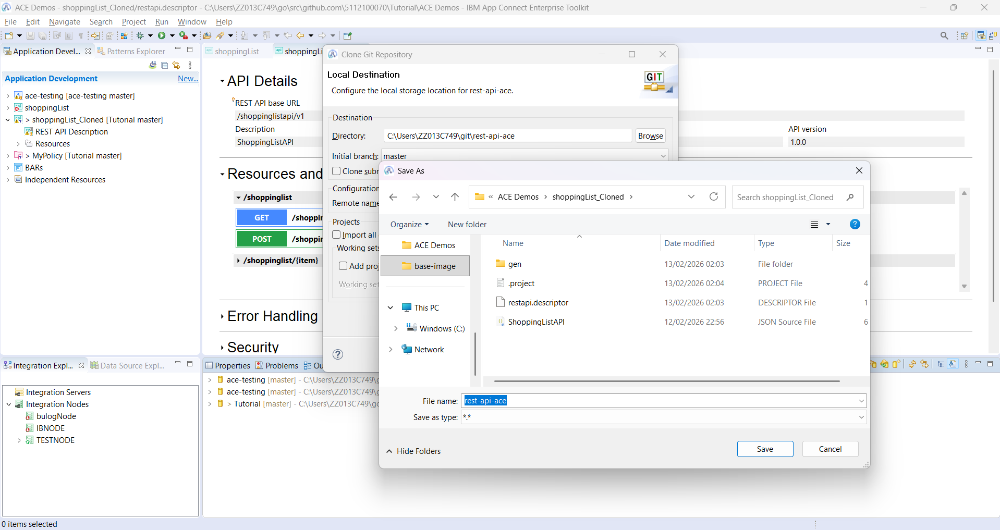

1. Click menu **File** → **Import**
2. Or right-click in the **Application Development** area → **Import**
3. The **Import** dialog will appear

**What's happening:** You are opening the import wizard to retrieve the project from the Git repository.

---

### Step 8: Select Import from Git

In the Import dialog:

1. Expand the **Git** folder
2. Select **Projects from Git**
3. Click **Next**

**What's happening:** You are selecting the option to import a project from a Git repository (in this case, GitLab).

---

### Step 9: Select Clone URI

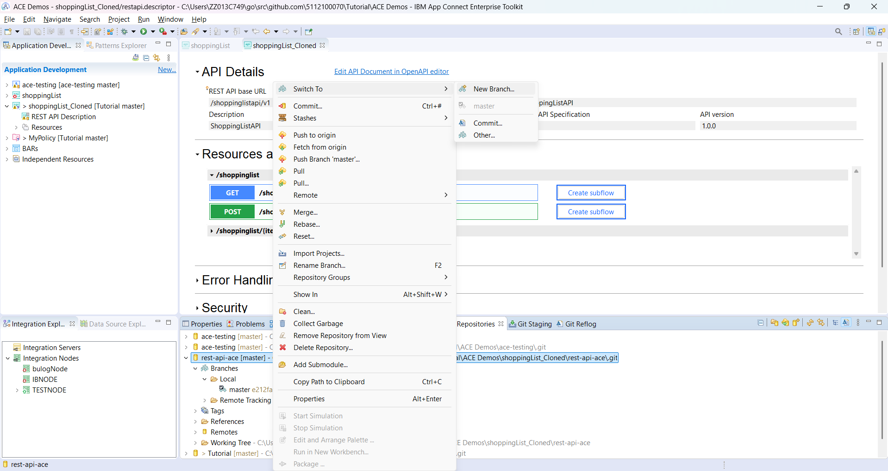

In the "Import Projects from Git" wizard:

1. Select **Clone URI**
2. Click **Next**

**Other available options:**
- **Existing local repository**: If the repository already exists locally
- **Clone URI**: To clone from a remote URL (what we're using)

**What's happening:** You are choosing to clone from a remote GitLab repository URL.

---

### Step 10: Enter Repository URL and Credentials

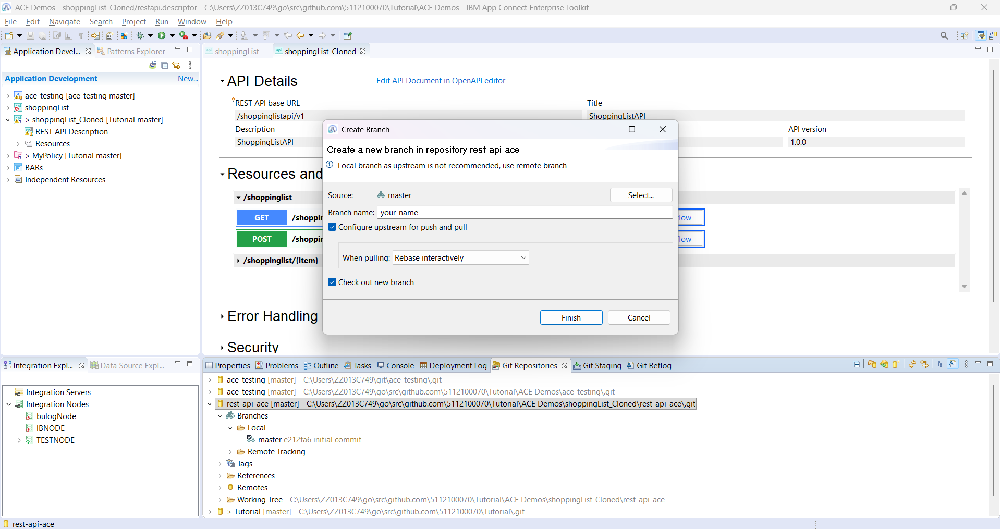

Enter the following information:

1. **URI**: `http://162.133.131.244/root/rest-api-ace.git`
2. **Host**: `162.133.131.244` (will auto-populate)
3. **Repository path**: `/root/rest-api-ace.git` (will auto-populate)
4. **Protocol**: `http` (will auto-populate)
5. **Port**: (leave empty or use default)

**Authentication:**
6. **User**: `public_access`
7. **Password**: `2026workshop`
8. Check **Store in Secure Store** to save credentials

9. Click **Next**

**What's happening:** You are configuring the connection to the GitLab repository with the provided credentials. ACE Toolkit will use this information to access and clone the repository.

---

### Step 11: Select Branch

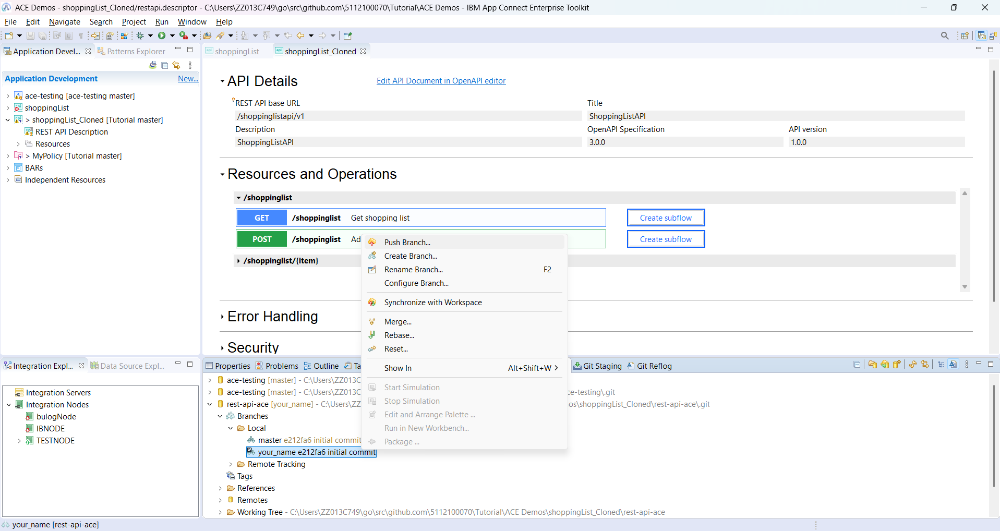

On the "Branch Selection" page:

1. You will see a list of available branches
2. Usually there is a **master** or **main** branch
3. Check the branch you want to clone (select **master**)
4. Click **Next**

**What's happening:** You are selecting which branch to clone. The master branch typically contains the stable version of the project.

---

### Step 12: Specify Local Destination

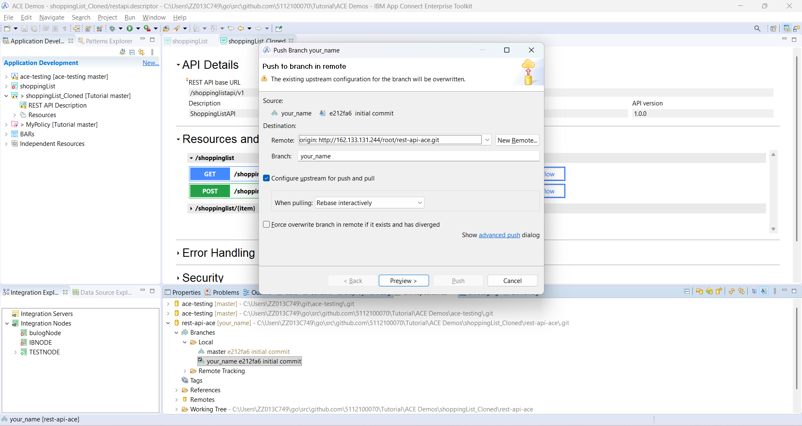

Configure the local storage location:

1. **Directory**: Choose or leave the default location
   - Default: `C:\Users\[Username]\git\rest-api-ace`
   - Or click **Browse** to select a custom location
2. **Initial branch**: `master` (matching the selected branch)
3. **Remote name**: `origin` (default name for remote repository)
4. Click **Next**

**What's happening:** You are determining where the project will be stored on your local computer. Git will create a new folder with the repository name.

---

### Step 13: Wait for Clone Process

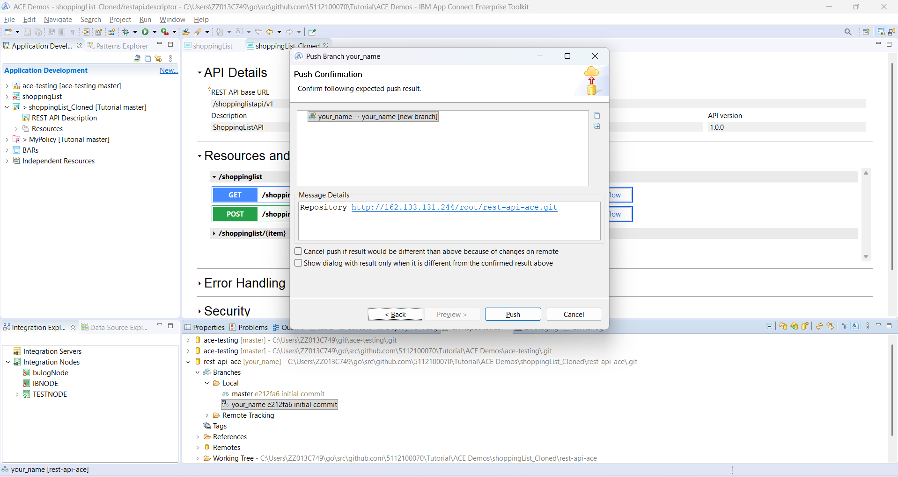

1. ACE Toolkit will start the clone process
2. You will see a progress bar
3. Status shows files being downloaded
4. Wait until the process completes

**What's happening:** Git is downloading all files, commit history, and metadata from the GitLab repository to your local computer.

---

### Step 14: Select Import Wizard

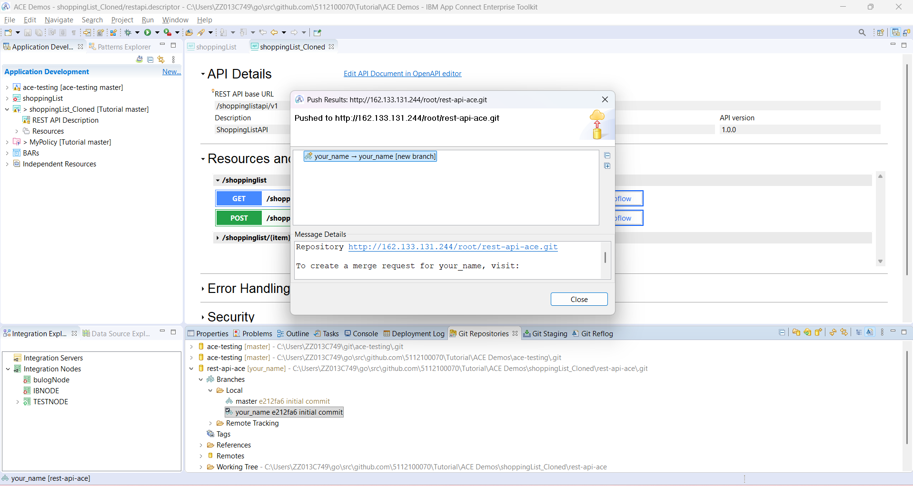

After cloning completes, choose the import method:

1. Select **Import existing Eclipse projects**
2. Click **Next**

**Other options:**
- **Import as general project**: For non-Eclipse projects
- **Import using the New Project wizard**: To create a new project

**What's happening:** Since ACE projects are Eclipse-based projects, we use the "Import existing Eclipse projects" option to import with the correct configuration.

---

### Step 15: Select Projects to Import

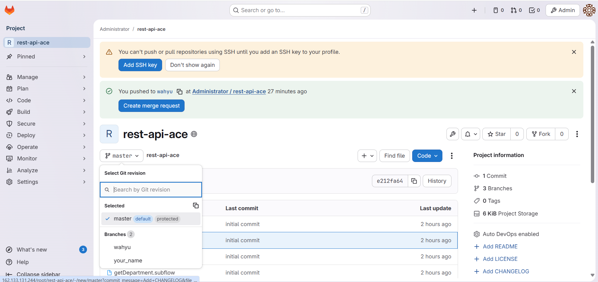

On the "Import Projects" page:

1. You will see a list of projects found in the repository
2. Check the projects you want to import
3. **Working Tree**: Local repository location
4. **Projects**: List of available projects
5. Ensure the desired project is checked
6. Click **Finish**

**What's happening:** ACE Toolkit identifies the ACE projects in the repository and is ready to import them into your workspace.

---

## Part 3: Verify and Rename Project

### Step 16: Verify Project Successfully Imported

After the import process completes:

1. The project will appear in the **Application Development** view
2. You can see the project structure:
   - Message flows (`.msgflow`)
   - Subflows (`.subflow`)
   - ESQL files (`.esql`)
   - Policies (`.policyxml`)
   - Application descriptor
   - Other resources

3. Expand the project to view file contents

**What's happening:** The ACE project from GitLab is now available in your local workspace and ready to use or modify.

---

### Step 17: Rename Project (Optional)

If you want to give a different name to the cloned project:

1. Right-click on the project
2. Select **Refactor** → **Rename**
3. Enter the new name: `shoppingList_Cloned`
4. Click **OK**

**What's happening:** The project will be renamed according to your preference, making it easier to identify that this is a cloned copy.

---

## Part 4: Working with the Cloned Project

### What You Can Do Now

**1. Explore Project:**
- Open and study message flows
- View ESQL logic
- Understand project structure
- Review policies and configurations

**2. Modify Project:**
- Edit message flows as needed
- Add new nodes
- Modify ESQL code
- Update policies

**3. Test Project:**
- Deploy to Integration Server
- Test with sample messages
- Debug if there are errors
- Verify functionality

**4. Commit Changes (If You Have Write Access):**
- Stage your changes
- Commit with clear messages
- Push back to GitLab (if you have permission)

---

## Part 5: Repository Information

### GitLab Access Details

**Repository Information:**
- **URL**: http://162.133.131.244/root/rest-api-ace.git
- **Username**: public_access
- **Password**: 2026workshop
- **Access Level**: Read-only (for public_access)

**Project Name Suggestion:**
- Original: `rest-api-ace`
- Cloned: `shoppingList_Cloned` (or your preferred name)

---

## Best Practices

### 1. Before Modification

**Backup Project:**
- Clone to a safe location
- Create a new branch for experiments
- Don't directly modify the master branch

**Understand Project:**
- Read documentation if available
- Explore all flows
- Understand dependencies
- Check policies and configurations

---

### 2. When Working with Clone

**Keep Updated:**
- Regularly pull changes from remote
- Sync with team members
- Check for updates before starting work

**Document Changes:**
- Record modifications you make
- Write clear commit messages
- Update documentation if needed

---

### 3. Collaboration

**If Working in a Team:**
- Communicate with team
- Use branches for features
- Review changes before merge
- Follow team's Git workflow

---

## Troubleshooting

### Common Issues and Solutions

**Issue: Authentication Failed**
- **Symptom**: "Authentication failed" when cloning
- **Solutions**:
  - Verify username: `public_access`
  - Verify password: `2026workshop`
  - Check network connection
  - Ensure GitLab server is accessible

**Issue: Connection Timeout**
- **Symptom**: "Connection timed out" or "Cannot connect"
- **Solutions**:
  - Check internet connection
  - Verify GitLab URL: http://162.133.131.244
  - Check firewall settings
  - Try again after some time

**Issue: Project Not Showing After Import**
- **Symptom**: Project doesn't appear in workspace
- **Solutions**:
  - Refresh workspace (F5)
  - Check if import completed successfully
  - Verify project location
  - Try importing again

**Issue: Cannot Open Message Flows**
- **Symptom**: Error when opening `.msgflow` files
- **Solutions**:
  - Ensure ACE Toolkit version is compatible
  - Check if all dependencies are installed
  - Verify project structure is intact
  - Re-import project if necessary

**Issue: Git Decorator Not Showing**
- **Symptom**: No Git icon next to project
- **Solutions**:
  - Project may not be connected to Git
  - Right-click project → Team → Share Project
  - Select existing repository
  - Reconnect to Git

---

## Summary

In this tutorial, you learned how to:
- ✅ Access GitLab repository with credentials
- ✅ Clone an ACE project from GitLab to local
- ✅ Import the cloned project into ACE Toolkit
- ✅ Verify the project was successfully imported
- ✅ Rename the project as needed
- ✅ Understand the structure of the cloned project

You now have a local copy of the IBM App Connect Enterprise project that you can explore, modify, and use for learning or development.

---

## Next Steps

After completing this tutorial, you can:

1. **Explore Project**: Study the message flows and existing logic
2. **Modify and Test**: Make changes and test functionality
3. **Create Your Own**: Use as a reference for new projects
4. **Learn Git Workflow**: Study branching, merging, and collaboration
5. **Deploy and Test**: Deploy to Integration Server and test with real data

---

## Additional Resources

- [GitLab Documentation](https://docs.gitlab.com/)
- [Git Clone Documentation](https://git-scm.com/docs/git-clone)
- [ACE Toolkit Documentation](https://www.ibm.com/docs/en/app-connect/13.0)
- [Git Best Practices](https://git-scm.com/book/en/v2)

---

## Quick Reference

### Clone Information

| Item | Value |
|------|-------|
| GitLab URL | http://162.133.131.244 |
| Repository URL | http://162.133.131.244/root/rest-api-ace.git |
| Username | public_access |
| Password | 2026workshop |
| Suggested Project Name | shoppingList_Cloned |
| Default Branch | master |

### Common Git Actions in ACE Toolkit

| Action | Menu Path |
|--------|-----------|
| Import from Git | File → Import → Git → Projects from Git |
| Clone Repository | Import → Git → Projects from Git → Clone URI |
| Pull Changes | Right-click project → Team → Pull |
| View History | Right-click project → Team → Show in History |
| Open Git Repositories View | Window → Show View → Other → Git → Git Repositories |

---

## Glossary

- **Clone**: Create a complete copy of a remote repository to local
- **Repository**: Storage location for code and version history
- **GitLab**: Web-based platform for Git repository management
- **Branch**: Independent line of development in a repository
- **Remote**: Reference to a repository hosted on a server
- **Origin**: Default name for remote repository
- **Pull**: Download and merge changes from remote to local
- **Workspace**: Working area in ACE Toolkit where projects are stored
- **Import**: Process of bringing a project into ACE Toolkit workspace

---

**Workshop Version**: 1.0  
**Last Updated**: February 2026  
**ACE Version**: 13.0.6.0  
**GitLab Version**: 15.0+