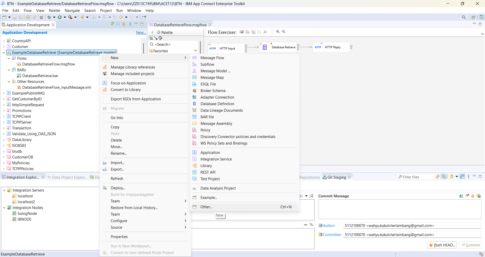
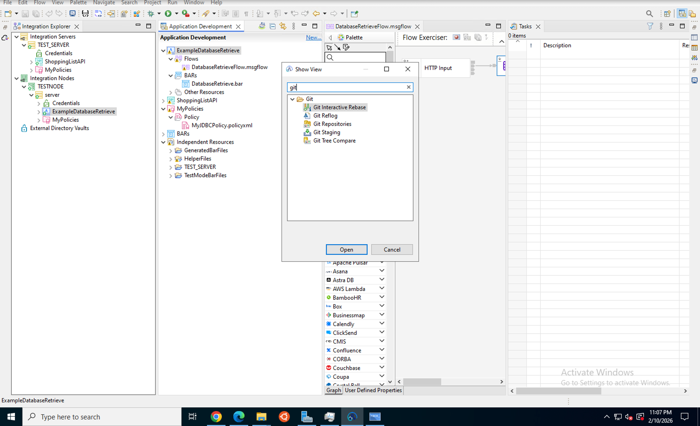
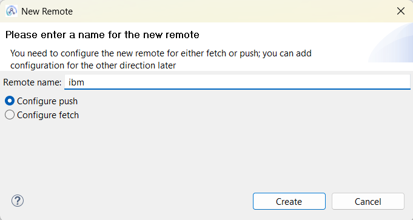
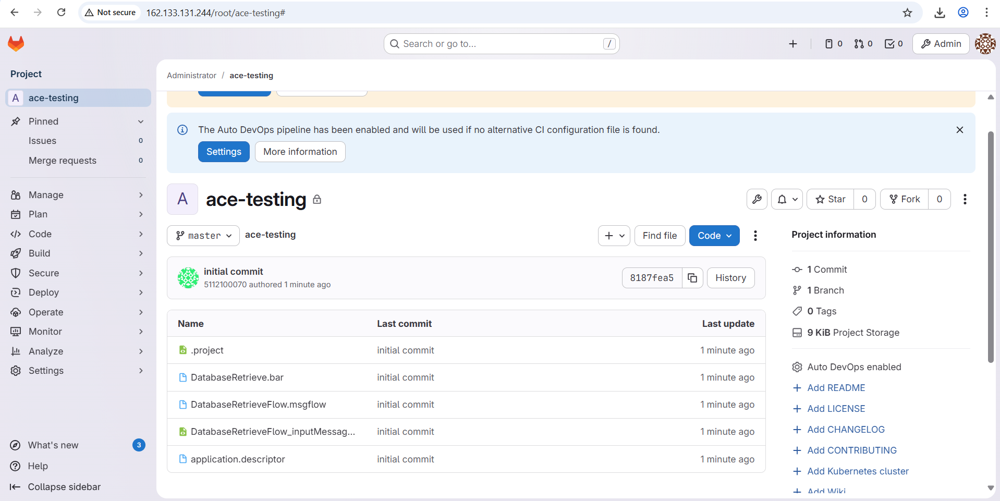

# Tutorial: Connecting ACE Projects to GitLab

## Overview
This tutorial teaches you how to connect IBM App Connect Enterprise projects to GitLab for version control and collaboration. You'll learn to initialize Git repositories, commit your ACE projects, and push them to GitLab, demonstrating how ACE integrates with modern DevOps tools.

## Learning Objectives
By the end of this tutorial, you will be able to:
- Initialize Git repositories for ACE projects
- Configure Git settings in ACE Toolkit
- Commit and track changes to integration projects
- Create GitLab repositories
- Push ACE projects to GitLab
- Understand GitLab's Auto DevOps capabilities
- Implement version control best practices

## Prerequisites
Before starting this tutorial, ensure you have:
- Completed Tutorial 3: Connect to Database (DB2)
- IBM App Connect Enterprise Toolkit 13.0.6.0 installed
- Git installed on your system
- GitLab account (GitLab.com or self-hosted instance)
- Basic understanding of Git concepts
- ACE project ready to version control (e.g., ExampleDatabaseRefine)

## Tutorial Duration
Approximately 20-30 minutes

---

## Part 1: Why Version Control for ACE?

### Benefits of Using GitLab with ACE

**Version Control:**
- Track all changes to integration flows
- See who changed what and when
- Easily revert to previous versions
- Maintain complete project history

**Collaboration:**
- Multiple developers can work on the same project
- Share code with team members
- Review changes before merging
- Coordinate work across teams

**CI/CD Ready:**
- GitLab Auto DevOps can automatically detect your project
- Ready for future automation (build, test, deploy)
- Integration with deployment pipelines
- Automated quality checks

**Professional Development:**
- Industry-standard version control
- Integration with modern DevOps practices
- Audit trail for compliance
- Backup and disaster recovery

---

## Part 2: Initializing Git Repository

### Step 1: Prepare Your ACE Project



1. Open IBM App Connect Enterprise Toolkit
2. Ensure your project (e.g., **ExampleDatabaseRefine**) is visible in the Application Development view
3. Verify your project contains:
   - Message flows (`.msgflow` files)
   - Subflows (`.subflow` files)
   - Policies (`.policyxml` files)
   - Application descriptor
   - Other project resources

4. **Save all files** before proceeding (Ctrl+S or File → Save All)

**What's happening:** Before version controlling your project, ensure all files are saved and the project is in a stable, working state. This will be your initial commit.

---

### Step 2: Create Git Repository


1. Right-click on your project in the Application Development view
2. Navigate to **Team** → **Share Project**
3. The "Create a New Git Repository" dialog will appear

**Alternative method:**
- Go to **File** → **Team** → **Create Repository**

**What's happening:** ACE Toolkit has built-in Git integration through EGit (Eclipse Git plugin), allowing you to manage version control directly from the IDE without leaving the development environment.

---

### Step 3: Configure Repository Settings


In the "Create a New Git Repository" dialog, configure:

1. **Repository directory**: 
   - Default: `C:\Users\Administrator\git\[ProjectName]`
   - Or click **Browse** to select a custom location
   - Recommended: Keep all Git repositories in a dedicated folder

2. **Default branch name**: 
   - Enter: `master` (traditional) or `main` (modern convention)
   - This will be your primary development branch

3. **Create as bare repository**: 
   - Leave **unchecked** (we need a working directory)

4. Click **Finish** to create the repository

**What's happening:** This creates a local Git repository in the specified directory and initializes it with the default branch. Your ACE project files will now be tracked by Git.

---

### Step 4: Verify Repository Creation

After creating the repository:

1. Look for the Git decorator (repository icon) next to your project name
2. The project is now under Git version control
3. A hidden `.git` folder has been created in your repository directory

**What's happening:** The `.git` folder contains all Git metadata, including commit history, branches, and configuration. This folder should never be manually edited.

---

## Part 3: Committing Your Project

### Step 5: Open Git Staging View



1. Go to **Window** → **Show View** → **Other**
2. In the Show View dialog, expand **Git**
3. Select **Git Staging**
4. Click **Open**

**Alternative method:**
- Right-click project → **Team** → **Commit**

**What's happening:** The Git Staging view shows all changes in your project, allowing you to select which files to include in your commit.

---

### Step 6: Stage Your Files

In the Git Staging view, you'll see two sections:

**Unstaged Changes** (files to be committed):
- `.project` (project configuration)
- `DatabaseRefine.bar` (BAR file)
- `DatabaseRefineFlow.msgflow` (message flow)
- `DatabaseRefineFlow_inputMessage.xml` (test message)
- `application.descriptor` (application metadata)
- Policy files (`.policyxml`)
- Other project resources

**To stage files:**
1. Click the **+** icon next to each file to stage individually
2. Or click **Stage All** button to stage everything at once
3. Files move to the **Staged Changes** section

**What's happening:** Staging allows you to selectively choose which changes to include in your commit. This is useful when you've made multiple changes but want to commit them separately with different messages.

---

### Step 7: Write Commit Message


In the **Commit Message** field:

1. Enter a descriptive message for your commit
2. **First line**: Brief summary (50 characters or less)
3. **Blank line** (optional)
4. **Detailed description** (optional, for complex changes)

**Example commit messages:**

```
Initial commit - Database integration project

Added ExampleDatabaseRefine project with:
- DatabaseRefineFlow message flow
- DB2 policy configuration
- Test messages for employee queries
```

```
Add employee search functionality

- Implemented employee search endpoint
- Added database query logic
- Configured error handling
```

5. Click **Commit** button to save your changes

**What's happening:** The commit message documents what changes were made and why. Good commit messages help you and your team understand the project history.

---

### Step 8: Verify Commit

After committing:

1. The **Git Staging** view should show "No changes"
2. Your changes are now saved in the local Git repository
3. View commit history:
   - Right-click project → **Team** → **Show in History**

**Important:** Your changes are currently only in your local repository. They haven't been pushed to GitLab yet.

---

## Part 4: Connecting to GitLab

### Step 9: Create GitLab Repository

Before pushing from ACE Toolkit, create a repository on GitLab:

1. **Log in to GitLab** (gitlab.com or your organization's instance)
2. Click **New Project** or **+** → **New project**
3. Choose **Create blank project**

4. **Configure your project:**
   - **Project name**: `ace-testing` (or your preferred name)
   - **Project slug**: `ace-testing` (URL-friendly name)
   - **Visibility**: 
     - **Private**: Only you and invited members can see it (recommended)
     - **Public**: Anyone can see it
   - **Initialize repository**: Leave **unchecked** (we'll push existing code)

5. Click **Create project**

**What's happening:** This creates an empty repository on GitLab that will receive your ACE project files.

---

### Step 10: Get GitLab Repository URL

After creating the GitLab project:

1. On the project page, you'll see the repository URL
2. Choose your preferred protocol:
   - **HTTPS**: `https://gitlab.com/username/ace-testing.git`
     - Easier to set up
     - Uses username/password or token
   - **SSH**: `git@gitlab.com:username/ace-testing.git`
     - More secure
     - Requires SSH key setup

3. Click the **Copy** button to copy the URL

**Recommendation:** Use HTTPS for simplicity, especially if you're new to Git.

**What's happening:** This URL is the remote address where your local Git repository will push changes.

---

### Step 11: Configure Git Remote



Back in ACE Toolkit:

1. Right-click your project → **Team** → **Remote** → **Configure Push to Upstream**
2. In the "New Remote" dialog:
   - **Remote name**: `ibm` (or use `origin` - the standard convention)
   - Select **Configure push** (should be selected by default)
   - Click **Create**

**What's happening:** A Git remote is a reference to a repository hosted elsewhere (in this case, GitLab). The name "origin" is the conventional name for the primary remote repository.

---

### Step 12: Enter GitLab URL and Credentials

After creating the remote:

1. **URI**: Paste your GitLab repository URL
   - Example: `https://gitlab.com/username/ace-testing.git`

2. The following fields will auto-populate:
   - **Host**: `gitlab.com`
   - **Repository path**: `/username/ace-testing.git`
   - **Protocol**: `https`
   - **Port**: `443`

3. **Authentication** (for HTTPS):
   - **User**: Your GitLab username
   - **Password**: Your GitLab password or personal access token
   - Check **Store in Secure Store** to save credentials

4. Click **Next**

**What's happening:** This configures where your commits will be pushed. The credentials are stored securely so you don't need to enter them every time.

---

### Step 13: Configure Branch Mapping

1. In the branch mapping screen:
   - **Source ref**: `refs/heads/master` (your local branch)
   - **Destination ref**: `refs/heads/master` (remote branch)
   - Click **Add Spec** to create the mapping

2. Review the configuration
3. Click **Finish**

**What's happening:** Branch mapping tells Git which local branch should push to which remote branch. This allows you to have different branch names locally and remotely if needed.

---

## Part 5: Pushing to GitLab

### Step 14: Push Your Project

1. Right-click your project → **Team** → **Push to Upstream**
2. Or in Git Staging view → click **Push** button

3. A push dialog will appear showing:
   - Commits to be pushed
   - Branch information
   - Remote repository details

4. Click **Push** or **OK**

5. **Monitor the push progress:**
   - ACE Toolkit will show push status
   - Wait for "Push completed successfully" message

**What's happening:** Git uploads your commits to the GitLab repository. This makes your code available on GitLab's servers and enables collaboration with team members.

---

### Step 15: Verify on GitLab



1. Open your GitLab project in a web browser
2. Navigate to the repository page
3. **Verify your files are present:**
   - `.project`
   - `DatabaseRefine.bar`
   - `DatabaseRefineFlow.msgflow`
   - `DatabaseRefineFlow_inputMessage.xml`
   - `application.descriptor`
   - Policy files
   - Other project resources

4. **Check the commit history:**
   - Click **Commits** to see your commit messages
   - Verify commit author and timestamp

5. **Auto DevOps Notification:**
   - You may see: "The Auto DevOps pipeline has been enabled and will be used if no alternative CI configuration file is found"
   - This means GitLab can automatically create CI/CD pipelines for your project

**What's happening:** Your ACE project is now stored in GitLab, version controlled, and ready for collaboration. GitLab has detected your project and is ready to provide CI/CD capabilities when you're ready to use them.

---

## Part 6: Understanding GitLab Features

### What You Can Do Now

**1. View Project Files:**
- Browse all your ACE project files in GitLab
- View file contents directly in the browser
- See file history and changes

**2. Commit History:**
- See all commits with messages
- View who made changes and when
- Compare different versions

**3. Collaboration:**
- Invite team members to your project
- Share the repository URL with colleagues
- Work together on integration projects

**4. Auto DevOps (Future):**
- GitLab has detected your project type
- Ready to automatically build and test
- Can be configured for automated deployment

**5. Project Management:**
- Create issues to track work
- Use merge requests for code review
- Add documentation in the wiki

---

## Part 7: Making Future Changes

### Workflow for Updates

When you make changes to your ACE project:

1. **Make changes** in ACE Toolkit
2. **Save your work** (Ctrl+S)
3. **Open Git Staging view**
4. **Review changes** in Unstaged Changes
5. **Stage files** you want to commit
6. **Write commit message** describing the changes
7. **Commit** to local repository
8. **Push** to GitLab

**Example workflow:**
```
Edit message flow → Save → Stage → Commit → Push
```

**What's happening:** This workflow ensures all your changes are tracked, documented, and backed up to GitLab.

---

## Part 8: Best Practices

### 1. Commit Message Guidelines

**Good commit messages:**
```
Add customer validation logic

- Added validation for customer ID format
- Implemented error handling for invalid IDs
- Updated test cases
```

**Bad commit messages:**
```
Fixed stuff
Updated files
Changes
```

**Tips:**
- Be descriptive but concise
- Explain what and why, not how
- Use present tense ("Add feature" not "Added feature")
- Reference issue numbers if applicable

---

### 2. What to Commit

**DO commit:**
- `.msgflow` files (message flows)
- `.esql` files (ESQL code)
- `.subflow` files (subflows)
- `.map` files (graphical mappings)
- `.policyxml` files (policies)
- `.descriptor` files (application descriptors)
- `.project` files (project configuration)
- Documentation files
- Test files

**DON'T commit:**
- `.bar` files (compiled artifacts)
- `.log` files (logs)
- Temporary files
- Sensitive credentials
- Large binary files

---

### 3. Create .gitignore File

Create a `.gitignore` file in your project root to exclude unnecessary files:

```gitignore
# BAR files (build artifacts)
*.bar

# Log files
*.log

# Temporary files
*.tmp
*.temp

# IDE files
.metadata/
.settings/

# Backup files
*~
*.bak
```

**What's happening:** `.gitignore` tells Git which files to ignore, preventing unnecessary or sensitive files from being committed.

---

### 4. Security Best Practices

**Never commit:**
- Database passwords
- API keys
- Certificates
- Private keys
- Personal access tokens

**Instead:**
- Use environment variables
- Store secrets in GitLab CI/CD variables (when you set up pipelines)
- Use external secret management tools
- Keep sensitive data out of version control

---

## Part 9: Troubleshooting

### Common Issues and Solutions

**Issue: HTTP 400 Error - Large File Push Failed**
- **Symptom**:
  ```
  error: RPC failed; HTTP 400 curl 22 The requested URL returned error: 400
  send-pack: unexpected disconnect while reading sideband packet
  Writing objects: 100% (150/150), 41.05 MiB | 24.60 MiB/s, done.
  fatal: the remote end hung up unexpectedly
  ```
- **Cause**: Pushing large files (especially .bar files) exceeds GitLab's HTTP request size limit
- **Solutions**:
  1. **Add .bar files to .gitignore** (recommended):
     ```bash
     echo "*.bar" >> .gitignore
     git add .gitignore
     git commit -m "Ignore BAR files"
     ```
  2. **Remove .bar files from Git history**:
     ```bash
     git rm --cached *.bar
     git commit -m "Remove BAR files from repository"
     git push
     ```
  3. **Increase Git buffer size** (temporary fix):
     ```bash
     git config http.postBuffer 524288000
     git push
     ```
  4. **Use SSH instead of HTTPS** (better for large files):
     - Configure SSH key in GitLab
     - Change remote URL to SSH
     - Push again

**Best Practice**: BAR files are compiled artifacts and should NOT be committed to Git. They should be generated during CI/CD builds, not stored in version control.

**Issue: Authentication Failed**
- **Symptom**: "Authentication failed" when pushing to GitLab
- **Solutions**:
  - Verify username and password/token are correct
  - For HTTPS: Use personal access token instead of password
  - Check network/firewall settings
  - Verify GitLab URL is correct

**Issue: Push Rejected**
- **Symptom**: "Updates were rejected because the remote contains work that you do not have locally"
- **Solutions**:
  - Pull latest changes first: Right-click project → **Team** → **Pull**
  - Resolve any merge conflicts
  - Commit merged changes
  - Push again

**Issue: Files Not Showing in Git Staging**
- **Symptom**: Changed files don't appear in Git Staging view
- **Solutions**:
  - Ensure files are saved
  - Refresh the Git Staging view
  - Check if files are in `.gitignore`
  - Verify project is under Git control

**Issue: Can't Find Git Staging View**
- **Symptom**: Git Staging view is not visible
- **Solutions**:
  - Go to **Window** → **Show View** → **Other**
  - Expand **Git** → Select **Git Staging**
  - Click **Open**

---

## Summary

In this tutorial, you learned how to:
- ✅ Initialize Git repositories for ACE projects
- ✅ Configure Git settings in ACE Toolkit
- ✅ Stage and commit changes with meaningful messages
- ✅ Create GitLab repositories
- ✅ Configure Git remotes and authentication
- ✅ Push ACE projects to GitLab
- ✅ Understand GitLab's Auto DevOps capabilities
- ✅ Apply version control best practices
- ✅ Troubleshoot common Git issues

You now have your ACE project version controlled in GitLab, demonstrating how ACE integrates with modern DevOps tools. Your project is ready for collaboration and future CI/CD automation.

---

## Next Steps

After completing this tutorial, you can:

1. **Invite Team Members**: Add colleagues to your GitLab project
2. **Create Branches**: Work on features in separate branches
3. **Use Merge Requests**: Implement code review process
4. **Explore GitLab Features**: Use issues, wikis, and project management tools
5. **Learn CI/CD**: When ready, explore GitLab's CI/CD pipelines for automated builds and deployments

---

## Additional Resources

- [GitLab Documentation](https://docs.gitlab.com/)
- [Git Documentation](https://git-scm.com/doc)
- [ACE Toolkit Documentation](https://www.ibm.com/docs/en/app-connect/13.0)
- [Git Best Practices](https://git-scm.com/book/en/v2)

---

## Quick Reference

### Common Git Actions in ACE Toolkit

| Action | Menu Path |
|--------|-----------|
| Create Repository | Team → Share Project |
| Commit Changes | Team → Commit |
| Push to GitLab | Team → Push to Upstream |
| Pull from GitLab | Team → Pull |
| View History | Team → Show in History |
| Open Git Staging | Window → Show View → Other → Git → Git Staging |

---

## Glossary

- **Git**: Distributed version control system
- **GitLab**: Web-based Git repository manager with DevOps capabilities
- **Repository**: Storage location for code and version history
- **Commit**: Snapshot of changes at a point in time
- **Push**: Upload local commits to remote repository (GitLab)
- **Pull**: Download and merge remote changes to local repository
- **Remote**: Reference to a repository hosted elsewhere
- **Branch**: Independent line of development
- **Staging**: Preparing files to be committed
- **Auto DevOps**: GitLab's automatic CI/CD pipeline detection

---

**Workshop Version**: 1.0  
**Last Updated**: January 2026  
**ACE Version**: 13.0.6.0  
**GitLab Version**: 15.0+