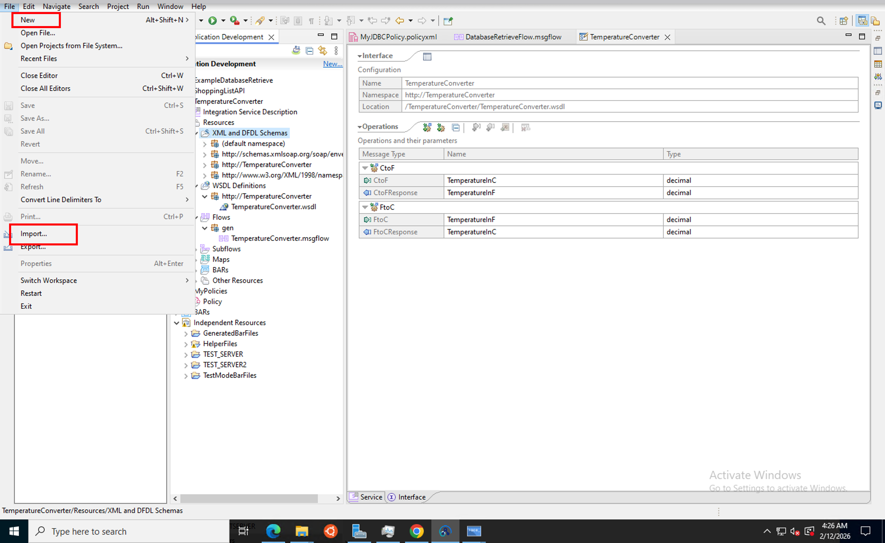
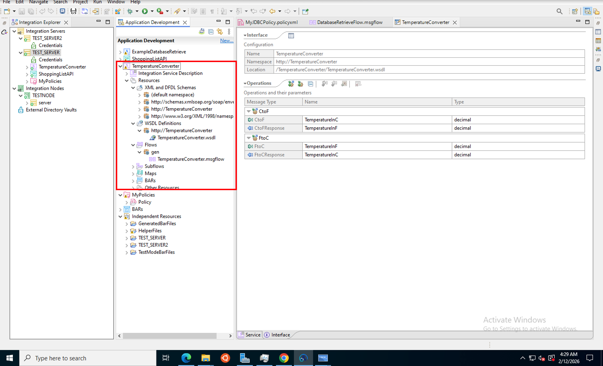

# Tutorial: SOAP Web Services with HTTP Input in IBM App Connect Enterprise

## Overview
This tutorial teaches you how to work with SOAP web services in IBM App Connect Enterprise using HTTP Input nodes. You'll learn to import SOAP service projects, understand WSDL definitions, deploy SOAP services, and test them using HTTP clients like cURL.

## Learning Objectives
By the end of this tutorial, you will be able to:
- Import SOAP web service projects into ACE
- Understand WSDL (Web Services Description Language) structure
- Work with SOAP message flows and HTTP Input nodes
- Deploy SOAP services to Integration Server
- Test SOAP services using cURL and HTTP clients
- Understand SOAP request and response formats
- Handle SOAP envelopes and namespaces

## Prerequisites
Before starting this tutorial, ensure you have:
- Completed previous tutorials (REST API, Transforming, Database)
- IBM App Connect Enterprise Toolkit 13.0.6.0 installed
- Basic understanding of SOAP and web services
- cURL or similar HTTP client installed
- Understanding of XML and namespaces

## Tutorial Duration
Approximately 15-20 minutes

---

## Part 1: Understanding SOAP Web Services

### What is SOAP?

**SOAP (Simple Object Access Protocol)** is a protocol for exchanging structured information in web services using XML.

**Key Characteristics:**
- **XML-based**: All messages are in XML format
- **Protocol-independent**: Can use HTTP, SMTP, TCP, etc.
- **Standardized**: Follows W3C standards
- **Envelope structure**: Messages wrapped in SOAP envelope
- **WSDL-defined**: Service interface described in WSDL

### SOAP vs REST

| Feature | SOAP | REST |
|---------|------|------|
| Protocol | Strict protocol | Architectural style |
| Format | XML only | JSON, XML, others |
| Standards | WS-* standards | No strict standards |
| Complexity | More complex | Simpler |
| Use Case | Enterprise, banking | Web, mobile apps |

### SOAP Message Structure

```xml
<?xml version="1.0"?>
<soapenv:Envelope xmlns:soapenv="http://schemas.xmlsoap.org/soap/envelope/">
  <soapenv:Header>
    <!-- Optional header information -->
  </soapenv:Header>
  <soapenv:Body>
    <!-- Actual message content -->
    <tem:TemperatureInC>0</tem:TemperatureInC>
  </soapenv:Body>
</soapenv:Envelope>
```

---

## Part 2: Importing SOAP Service Project

### Step 1: Access Import Function



1. In ACE Toolkit, go to **File** menu
2. Select **Import...**
3. The Import wizard will open

**What's happening:** You'll import a pre-configured SOAP service project that demonstrates temperature conversion functionality.

---

### Step 2: Select Project Interchange

1. In the Import wizard, expand **IBM Integration**
2. Select **Project Interchange**
3. Click **Next**

**What's happening:** Project Interchange allows you to import complete ACE projects with all their resources, including WSDL files, schemas, and message flows.

---

### Step 3: Browse for SOAP Project

1. Click **Browse** to locate the project file
2. Navigate to the workshop materials folder
3. Select the SOAP service project file (e.g., `TemperatureConverter.zip`)
4. Click **Next**

**What's happening:** The project contains a complete SOAP web service implementation with WSDL definition, XML schemas, and message flows.

---

### Step 4: Complete Import

1. Review the projects to be imported
2. Ensure **TemperatureConverter** project is selected
3. Click **Finish**
4. Wait for the import to complete

**What's happening:** ACE extracts the project and makes all SOAP service resources available in your workspace.

---

## Part 3: Understanding the SOAP Project Structure

### Step 5: Explore Project Structure



After import, expand the **TemperatureConverter** project to see:

**1. WSDL and HPDL Schemas:**
- `XML and HPDL Schemas` folder
- Contains WSDL files defining the service interface
- Includes XML schema definitions (XSD)

**2. Resources:**
- WSDL definitions
- Schema files
- Service descriptions

**3. Flows:**
- `TemperatureConverter.msgflow` - Main message flow
- Handles SOAP requests and responses

**4. Subflows:**
- Reusable flow components
- Business logic implementation

**5. BAR Files:**
- Compiled deployment artifacts

**6. Policies:**
- Service policies and configurations

**What's happening:** This structure represents a complete SOAP web service with all necessary components for deployment and execution.

---

### Step 6: Understanding WSDL

**WSDL (Web Services Description Language)** defines:

**1. Types:** Data types used by the service
```xml
<types>
  <xsd:schema>
    <xsd:element name="TemperatureInC" type="xsd:decimal"/>
    <xsd:element name="TemperatureInF" type="xsd:decimal"/>
  </xsd:schema>
</types>
```

**2. Messages:** Input and output messages
```xml
<message name="CtoFRequest">
  <part name="parameters" element="tem:TemperatureInC"/>
</message>
<message name="CtoFResponse">
  <part name="parameters" element="tem:TemperatureInF"/>
</message>
```

**3. Port Type:** Operations available
```xml
<portType name="TemperatureConverterPortType">
  <operation name="CtoF">
    <input message="tem:CtoFRequest"/>
    <output message="tem:CtoFResponse"/>
  </operation>
</portType>
```

**4. Binding:** Protocol and format details
```xml
<binding name="TemperatureConverterBinding" type="tem:TemperatureConverterPortType">
  <soap:binding transport="http://schemas.xmlsoap.org/soap/http"/>
  <operation name="CtoF">
    <soap:operation soapAction="http://TemperatureConverter"/>
  </operation>
</binding>
```

**5. Service:** Endpoint location
```xml
<service name="TemperatureConverter">
  <port name="TemperatureConverterPort" binding="tem:TemperatureConverterBinding">
    <soap:address location="http://localhost:7800/TemperatureConverter"/>
  </port>
</service>
```

---

### Step 7: View SOAP Operations

In the project structure, you'll see operations defined:

**Available Operations:**
- **CtoF**: Convert Celsius to Fahrenheit
- **FtoC**: Convert Fahrenheit to Celsius (if available)
- **CtoFResponse**: Response message type
- **TemperatureInC**: Input parameter (decimal)
- **TemperatureInF**: Output parameter (decimal)

**What's happening:** Each operation represents a specific function the SOAP service can perform. The WSDL defines the input/output structure for each operation.

---

## Part 4: Understanding the Message Flow

### Step 8: Open Message Flow

1. In the project, locate `TemperatureConverter.msgflow`
2. Double-click to open the message flow editor
3. You'll see the flow structure:

**Flow Components:**
```
HTTP Input → SOAP Input → Compute/Transform → SOAP Reply → HTTP Reply
```

**Node Descriptions:**

**1. HTTP Input Node:**
- Receives HTTP POST requests
- Listens on specified port (7800)
- Accepts SOAP XML messages

**2. SOAP Input Node:**
- Parses SOAP envelope
- Extracts message body
- Validates against WSDL

**3. Compute/Transform Node:**
- Implements business logic
- Performs temperature conversion
- Formula: F = (C × 9/5) + 32

**4. SOAP Reply Node:**
- Wraps response in SOAP envelope
- Adds proper namespaces
- Formats according to WSDL

**5. HTTP Reply Node:**
- Sends HTTP response
- Sets appropriate headers
- Returns SOAP XML to client

**What's happening:** The message flow processes incoming SOAP requests, performs the conversion, and returns properly formatted SOAP responses.

---

## Part 5: Deploying the SOAP Service

### Step 9: Deploy to Integration Server


1. Right-click on the **TemperatureConverter** project
2. Select **Deploy** → **TEST_SERVER** (or your integration server)
3. In the Deploy dialog:
   - Select **TEST_SERVER** from the list
   - Verify the server is running
4. Click **Finish**

**What's happening:** Deployment packages the SOAP service and deploys it to the Integration Server, making it available to receive HTTP requests on the configured port.

---

### Step 10: Verify Deployment

After deployment:

1. Check the console for deployment messages:
   ```
   BIP2155I: About to 'Start' the deployed resource 'TemperatureConverter'
   BIP2155I: Successfully started message flow 'TemperatureConverter.msgflow'
   ```

2. Verify the service is listening:
   - Default port: 7800
   - Endpoint: `/TemperatureConverter/TemperatureConverter`

**What's happening:** The Integration Server has started the message flow and is now listening for SOAP requests on the HTTP endpoint.

---

## Part 6: Testing the SOAP Service

### Step 11: Understanding the Test Approach

**Testing Methods:**
1. **cURL** (command line)

**What we'll test:**
- Convert 0°C to Fahrenheit (should return 32°F)
- Verify SOAP envelope structure
- Check response format

---

### Step 12: Test with cURL

**1. Navigate to workspace directory:**
```bash
cd C:\Users\Administrator\IBM\ACET13\workspace
```

**2. Send SOAP request using cURL:**
```bash
curl -X POST http://localhost:7800/TemperatureConverter/TemperatureConverter -d @.\TemperatureConverter\CtoFrequest.xml
```

**3. This input message looks like this:**
```<soapenv:Envelope xmlns:soapenv="http://schemas.xmlsoap.org/soap/envelope/" xmlns:tem="http://TemperatureConverter">
<soapenv:Body>
<tem:CtoF><TemperatureInC>0</TemperatureInC></tem:CtoF>
</soapenv:Body>
</soapenv:Envelope>
```

**What's happening:** cURL sends an HTTP POST request with the SOAP XML message to the service endpoint. The service processes the request and returns a SOAP response.

---

### Step 13: Understanding the Response

**The reply message should look like this:**

```<?xml version="1.0" encoding="utf-8"?>
<soapenv:Envelope xmlns:soapenv="http://schemas.xmlsoap.org/soap/envelope/">
<soapenv:Body>
<io:CtoFResponse xmlns:io="http://TemperatureConverter"><TemperatureInF>32</TemperatureInF></io:CtoFResponse>
</soapenv:Body>
</soapenv:Envelope>
```

**Components:**
- **Envelope**: SOAP response wrapper
- **Body**: Contains the response data
- **CtoFResponse**: Response element
- **TemperatureInF**: Output parameter (32 degrees Fahrenheit)

**Conversion Verification:**
- Input: 0°C
- Formula: F = (0 × 9/5) + 32 = 32°F
- Output: 32°F ✓

---

### Step 15: Test Other Operations

**Test with different temperatures:**

**Test Case 1: 100°C (boiling point)**
```xml
<TemperatureInC>100</TemperatureInC>
```
Expected: 212°F

**Test Case 2: -40°C**
```xml
<TemperatureInC>-40</TemperatureInC>
```
Expected: -40°F (same in both scales!)

**Test Case 3: 37°C (body temperature)**
```xml
<TemperatureInC>37</TemperatureInC>
```
Expected: 98.6°F